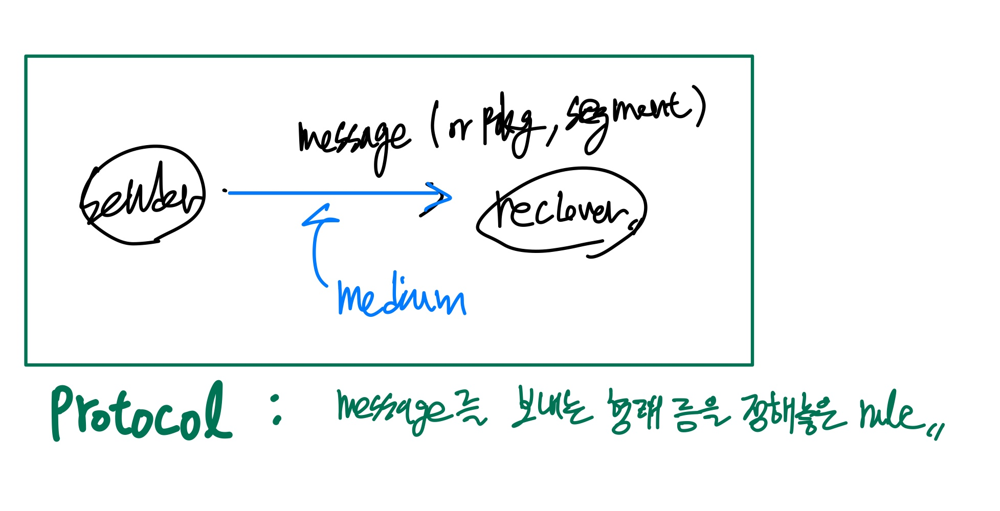

# 컴네

- 강의계획서 내에 pdf 사이트 있음
- OSI 7 Layer에 관한 공부 필요

[족보](https://www.notion.so/27eff2baaf92805b9d0eeb4cb0a68223?pvs=21)

---

# #1

- Computer network → Computer network**ing** 동적으로 필요한 장치를 사용하는 흐름으로 변환 하나의 형태에 정착해있지 X

- 로봇 중심의 기술로 통신의 요구사항 전환됨(from 인간)
- 4차 산업혁명은 결국 1,2,3차를 하나로 통합한 것. → 한국과 독일만 산업혁명이 1번만 일어난 것이 아니라고 주장.
- **OSI 7 Layer ⇒ 나중에 족보 구해서 예시 확실히 찾아보기**
    - 컴퓨터 네트워킹의 가장 중요한 원칙
    - Open System Interconnection의 약자
    1. Sender와 Reciever의 관계에서 서로가 **거쳐가는 계층 순서는 반대**임. Sender : 7→1, Reciever : 1→7.
        1. 각 계층은 **독립적**으로 사용됨. 각 계층별 장치를 만들고, 그것이 한 곳에서 만들어진 것이 아니라도, 서로 호환하여 사용할 수 있게 만들어짐.
    2. **각 계층**은 Encrypt ↔ Decrypt등과 같이 Sender, Receiver가 가지는 형태만 **연관**돼있음
    - OSI 7 Layer View
        1. Physical Layer (Communicaiton)
            
            어떤 방식(유선, 무선)으로든 비트정보(0/1)를 연속적으로 전송하는 것(Bit stream)
            
            ⇒ 줄 1개로 지칭!
            
            ex) Wifi 무선 신호, RS 232 (유선 통신 장치)
            
        2. Data Link Layer(Communicaiton)
            
            에러 탐지, 전송량의 흐름 조절
            
            ex) ethernet(LAN 통신), 
            
        3. Network Layer
            
            줄 2개 이상일 때, 길잡이 역할 해주는 것(routing(복잡), switching(간단))
            ex) IP
            
        4. Transport Layer
            
            2nd layer와 비슷함. 단 양 극단(End-to-End)에 있는 장치끼리만 소통하며, 에러 검출, 흐름제어하는 것.
            
            ex) TCP(신뢰성있는 전송), UDP(비연결성 데이터그램)
            
        5. Session Layer
            
            이 세션에 대한 승인(Authentication)/권한(permission)/관리(session restoration)를 부여하는 것.
            
            만약 traffic 증가 등으로 시스템이 다운됐을 때 다운된 동안에 들어온 명령들을 저장했다가 다시 입력해주는 등
            
        6. Presentation Layer
            
            정보 표현 형식 변환해주는 layer
            
            ASCII 코드 인코딩(encryption)/ png(무손실 압축),jpg(손실압축방식)등으로 compression
            
        7. Application Layer
            
            네트워크 서비스를 사용하기 위한 인터페이스 제공
            
            ex) HTTP(web 브라우저)
            
    1. 1,2 layer는 communication layer로, 데이터가 실제로 전송되는 방법을 다룸.
    2. 5,6,7layer를 모두 묶어서 Application으로 단순화하기도 함. 이때 http(웹브라우저), CoAP(제한된 애플리케이션 프로토콜), DNS(도메인 네임 시스템), JSON(텍스트 기반 데이터 직렬화 형식)등이 여기에 들어감
    3. SKT, KT와 같은 이동통신사는 주로 1-4계층에 대한 작업만 함
    4. 블루투스는 bluetooth device로 지칭되는 것이 일반적이다 보니, 장치를 무조건 동반, 따라서 1-7계층을 모두 아우르게 됨.

---

# #2

- 과거에는 특정 목적에 따라 하드웨어를 따로 제작함.
    
    ex) 키오스크 전용, 전광판 제어 전용, 혹은 무선 로봇 청소기 : 카메라, 이동 센서 등
    
- 이에 대한 비용 문제도 많이 발생. ⇒ **해결점 : 아두이노(born in 2007)**
    - 아날로그/디지털 input → 아날로그/디지털 output으로 구동되고, 이 회로도를 오픈소스로 풀어버림. 능력이 있다면 그대로 만들면 되고, 판매 가격 또한 저렴.
    - 부족한 스펙들을 추가 장치를 연결하여 보충하기 시작.
- 오픈소스 데이터센터(서버, GPU, 스토리지 디스크 네트워크)를 페이스북에서 공개함. (Name : **OCP** (Open Compute Project))
    
    **페이스북에서 생각한 포인트 :**
    
    - 컴퓨터를 구입할 때, 쓰지도 않는 기능이 너무 많음. 필요한 기능만 갖춘 것이 필요.
    - 그걸 각 분야 전문가들을 추가 채용하여 인프라를 구성해냄.
    
    2013년에 만들어짐.
    
    그로 인해 기존 대비,
    
    1. **전력 사용량이 1/5**로 줄어듦.(안 쓰는 장치들이 더이상 전력을 잡아먹지 않으니)
    2. **네트워크 죽는 시간이 1/25**로 줄어듦.(안 쓰는 하드웨어, 소프트웨어를 몰아내니)
    3. **유용한 CPU 디스크는 50% 더** 들어갈 수 있게 됨
    4. **줄의 무게가 1/3**으로 줄어듦.(안 쓰는 구멍들을 다 없애버렸으니)
    
- **오픈소스 데이터 센터에 더해 5G로 이동통신 제공하는 프로젝트의 이름 : TIP(Telecom Infra Project)**
    
    KT, SKT, LG U+등이 제공하는 텔레커뮤니케이션 서비스도 오픈소스로 만들자라는 의미
    
    but, 5G 이동 통신을 오픈 소스로 하지는 않음.
    
    Why?? ⇒ **굳이 할 필요 없기 때문.** 아직 5G 이동통신 장치는 전 세계에서 5곳만 만들 수 있고, 만약 이 **비용이 상승하여 threshold를 돌파하면, 그땐 오픈소스로 통신할 가능성이 높음!**
    
- 구글 직원들이 함께 모여서 쓴 논문 한 편이 2015년 발표됨. **(Classic과 Modern의 차이)**
    - 내용은 10년동안 구글이 본인들의 데이터 센터 안에 있는 CPU와 디스크와 기타 장치를 어떻게 네트워킹 했는 지에 대한 것.
    - 구글의 시작은 검색엔진이였음. 이걸 위해 직접 리눅스로 만든 HTTP 서버가 동작하기에 최적인 OS를 커스터마이징했고, 이에 맞는 CPU 카드도 직접 만듦.
    
    모든 걸 자신들만의 규칙대로 하드웨어, 소프트웨어 만들었고, 자신들의 구역 안에서만 통신하면 됐음.(2~3M개의 CPU가 다 내꺼)
    
    ⇒ 표준(OSI 7 Layer) 규칙을 굳이 따를 필요 없음. 모든 건 내부의 문제기 때문에 알아서 해결 가능.
    
    **결국, 내 것끼리 통신하고 문제 생길 시 알아서 처리하는, 표준을 굳이 지키지 않는 것이 결국 Modern 파트의 중요한 부분!**
    
    Classic에서는 특허와 표준이 중요했음.
    
    Modern에서는 일단 오픈소스로 내보내서 사람들이 다양하게 오픈소스를 쓰고 이후에 특허 문서로 작업을 함.
    
- off the record같긴 한데, 영국은 학생들에게 줄 수 있는 컴퓨터 개수가 확보되기 전까진 교육을 중지시킴. 근데 그 상황에 **라즈베리 파이가 나옴!**
    - CPU는 암 프로세서 탑재
    - 아두이노와 달리, 모든 게 갖춰진 컴퓨터. (CPU, HDMI, CRT 아날로그 모니터 잭)
    - 여기에 올린 OS 라즈피안은 리눅스의 Ubuntu.
        
        ⇒ 이것이 주안점. 진짜 리눅스를 탑재한 굉장히 작은 컴퓨터가 생겼기 때문에, 이걸로 다양한 장치를 만들 수 있게 됨. ⇒ 전세계 유무선 공유기의 95%를 리눅스로 돌리고 있는 중.
        
        **즉, 컴퓨터가 세상에 굉장히 많아짐.**
        
    
    Linux : 공짜 + 라즈베리 파이 : 3만원쯤 ⇒ 기존(Windows, Intel) 대비, 굉장히 저렴해짐
    
    ⇒ **이를 임베디드 시스템의 표준 OS로 바꿈. OSI 7 Layer들을 모두 올릴 수 있음.**
    
- 라즈베리 파이 이후에, ODROID(삼성꺼 집어넣음), BeagleBone(미국재), NUC(Intel), Coral(Google), Jetson(NVDIA) 등이 개발되면서, 다양성이 많아짐.

---

# #3

- 네트워킹에선 과거의 것이 현재의 것을 해결할 수 있으면 그걸 씀. 굳이 현재의 것을 사용하지 X.(소프트웨어는 기존의 것을 계속 개선해나가는 형태)
    - 통신 : 장단점을 논하는 집단. 새로운 기술은 보다 복잡해짐. 복잡해질 수록 더 많은 컴퓨팅 파워를 요해서 기존의 것이 해결 가능하면 그걸 쓴다는 뜻.
1. Five Basic Terminologies
    - **Sender**(Transmitter) : 보내는 쪽
    - **Receiver** : 받는 쪽
    - **Message** (or package or segment) : sender가 receiver에게 보내는 무언가
    - **Medium** : 정보가 어떠한 방식으로든 전달되는 매체(케이블, 무선 등)
    - **Protocol** : 통신에서의 규칙(보내는 형식을 어떻게 할 것인지, 받는 과정을 어떻게 할 것인지 등)
        
        
        
    
2. Data Flow Direction
    
    컴퓨터 네트워크에서 정보를 주고 받는 방향별 명칭
    
    - Simplex
    - Half-duplex
        
        ex) 무전기, 핸드토키 등
        
    - Full-duplex
        
        ex) 카카오톡 메신저
        
    
    
    

1. Physical Structure
    
    컴퓨터 네트워크에서 Medium의 연결 방식에 대한 명칭
    
    - Point-to-point
        
        ex) 유선 통신 초고속 인터넷의 오리지널 버전
        
    - **Multipoint**
        
        ⇒ 2계층 하부구조의 대부분을 차지
        
        ex)  모든 무선 통신
        
    
    
    

1. Topology
    1. Mesh
        - 각각 전용의 줄이 있는 것 ⇒ 중간에 한 두 개 없어도 mesh.
        - 장점
            - 하나가 망가져도 괜춘 ⇒ 다른 얘들이 이어줄 것이기 때문에
        - 단점
            - 사용하게 되는 케이블 수가 많아져, 비용 문제가 생김.
        
    2. Star(or Tree(줄기와 뿌리))
        - 장점
            - 사용 케이블 수가 적어짐
                
                ⇒ 비용이 감소하고, 편리성이 올라감
                
        - 단점
            - 안정성 떨어짐. 허브에 문제가 생길 시, 모든 통신이 망가져버림.
        
    3. Bus
        - 한 개의 줄에 여러 대의 컴퓨터를 연결해놓음
        - 장점
            - 비용이 감소하고, 편리성 올라감.
        - 단점
            - 줄 끊어지면 끝.
            
    4. Ring
        - Bus의 단점을 해소한 방식
    
    
    
    ⇒ 결국 나중엔 서로의 단점을 보완하며, bus + star의 형태로 만들어지기도 함.
    
2. Categlries of Networks ⇒ 줄의 규모
    1. **LAN**(Local Area Network)
        
        작은 범위(하나의 사무실, 빌딩 혹은 캠퍼스) 정도를 커버하는 네트워크
        
        +⇒ 유선말고 무선은 명시적으로 표시하는 것이 일반적.
        
        ex) 경희대 전정대 네트워크(경희대 무선 KHU WIFI), 삼성 네트워크.
        
    2. **MAN**(Matropolitan Area Network)
        
        LAN들의 집합체, 수 킬로미터까지 뻗어나갈 수 있는 도시 규모를 연결해서 구축하는 것
        
        ex) 이동통신
        
    3. **WAN**(Wide Area Network)
        
        매우 멀리까지 가는 줄, 특정 포인트와 포인트를 잇는 줄(유/무선) 형태의 네트워크.
        
        ex) 경희 설/국캠을 잇는 것. 혹은 사막에서 송유관 중간 중간에 센서를 놓고 석유 유출량을 제어하는 것, 지구와 인공위성을 서로 통신하는 것 등.
        
    4. **BAN**(Body Area Network)
        
        몸 상태를 체크하는 형태의 (주로) 무선 네트워크.
        
        ex) 내시경 알약을 먹으면, 몸 외부에 있는 장치(디스크)와 알약에 있는 카메라 등의 센서가 서로 교신하며 내시경 결과를 실시간으로 찍어보내주는 등.
        
    5. **PAN**(Personal Area Network)
        
        허브가 되는 장치로부터 줄을 없앤 형태의 네트워크
        
        ex) 블루투스
        
    
3. Standard ⇒ 상호 연동성의 기준
    1. De facto(by fact, 사실상 표준)
        
        ⇒ 대세로 이렇게 만들어서, 이것을 ‘업계 표준’처럼 사용하게 됨.
        
        ⇒ modern한 부분
        
        ex) 구글이 세운 http2 표준, 서버, 네트워크
        
    2. De jure(by law)
        
        ⇒ 문서, 특허 등으로 지정함. 그에 따른 제품과 서비스를 만든다.
        
        ⇒ classic한 부분
        
        ex) 이동통신
        
- MAC(Multiple Access Control)
    
    ⇒ 2계층이 두 개로 쪼개지는데, 아래 계층을 주로 MAC이라고 부름.
    
    1. **Random-access protocols**
        
        ⇒ multi point가 하나의 medium에 연결하고 싶으면 연결
        
        ⇒ 이 줄을 나눠쓰는 데에 생기는 문제 발생. (uncontrolled, random한 상황이다 보니)
        
        ⇒ 여러 point에서 신호를 쏘다 보면, 과부하가 걸려서 통신 자체가 안 돼버림.(병목현상 X, 병목현상은 결국엔 뚫리는 현상을 말하지만, 이건 아예 끝나버리는 상황)
        
        ⇒ 따라서 최소한의 protocol을 지켜야하는 에티켓만이 존재.
        
        무선 LAN, 초고속 인터넷의 원형. but, 지금은 모습이 많이 바뀌었으나, 밑에 깔려있음.
        
        1. ALOHA
            
            ⇒ 섬들간의 정보를 주고받기 위해서 이것을 만듦.
            
            ⇒ protocol : 보내고 싶은 station은 보낸다.
            
            ⇒ 다음과 같은 문제 발생
            
            
            
            sender로 동작하는 station이 2개 이상일 때 collision point가 생김. 노란 파트 동안은 통신이 안 되고, 최악의 경우엔, 꼬리에 꼬리를 물고 늘어져서 forever 통신이 안 됨.
            
            ⇒but, 1970년에 만들어진 이 기술은 1970년대 후반까지 문제가 없었음.
            
            How?? ⇒ 동작 flow가 거의 simplex였음. 주로 기상에 대한 정보를 전달하면서, 오늘 밖에 나가지 말라는 등의 정보였음. 물론 양방향 소통은 가능했지만, 실제로 쓰인 것은 거의 simplex방식이었다는 뜻. ⇒ collision 적었음
            
            ⇒ 즉, 트래픽 적거나, 노드의 수가 적다면, ALOHA는 여전히 유효.(에러 검출 및 복구도 최대한 잘 되고 있었음.)
            
            - Slotted ALOHA network
                
                변경된 protocol : 시간을 단위시간으로 쪼개서(ex) 10초 단위), 단위 시간이 됐을 때만 쏴라!
                
                
                
                ⇒ slot2,3만 깨짐.
                
                ⇒ 즉, **충돌을 해결하자 X**
                
                ⇒ **충돌로 인한 피해를 줄여보자**
                
                **이것이 통신, 문제를 해결하지 못하면, 문제로 인한 피해라도 최소화시키는 것.**
                
        2. CSMA/CD & CSMA/CA
            
            미국 본토의 연구자들이 ALOHA의 사례를 보고 만들어낸 것
            
            - CSMA/CD : 유선 초고속 인터넷의 원형.
            - CSMA/CA : 무선 초고속 인터넷의 원형.
            
            but, 둘 다 이젠 실전에서 많이 쓰는 것은 아님. but, 요즘에 쓰이는 것들의 원류는 이것들.
            
            - CSMA = Carrier Sense Multiple Access
                
                ⇒ 전압(carrier)이 여러 access들의 흐름을 읽는 것
                
                ⇒ protocol : 신호를 쏘기 전에, 다른 얘들이 쏘고 있는 지 듣고 쏴라.
                
                
                
                ⇒ but, 듣고 있음에도, B가 쏜 신호가 C에 도달하기까지의 시간이 있으니 C 입장에선 B가 쏜 지 모름. 근데 여기서 C가 쏘게 되면서, cross point부터는 통신이 아예 안 되게 됨.
                
                
                
                A가 쏘고 나서 D에 도착할 때까지의 **전파 전송 시간**이 있기에 그 시간 동안에 D가 쏘고 둘이 만나면, 충돌로 작동이 안 됨.
                

---

# #4

slotted ALOHA같은 느낌. 

- b는 a에 비해 충돌여지가 $\downarrow$ , but 전력 소모$\uparrow$(a보다 사용하는 시간을 늘렸으니)
- b는 또 c에 비해 빠름.
- 만약 **112,119** 등이 이것과 똑같은 체계를 따라가면, 위급상황에서 문제가 생김
    
    ⇒ b의 경우에서 **Transmit하는 때를 남들보다 앞당김**. 이렇게 되면 먼저 쏘게 돼서 collision이 발생하지 X
    

- **CSMA/CD - 유선**
    
    
    
    **C**ollision **D**etect
    
    ⇒ 이제 충돌을 어떻게 할 것인지가 아닌, **충돌 이후에 어떻게 할 것**인가로 관심사가 변경.
    
    ⇒ **쏘는 중에도 sensing하는 것!**
    
    CSMA에서는 cross point 아랫부분은 모두 collision이 일어나서, 그 뒤에 통신이 **다** 망가지는 경우였음.
    
    but /CD로 넘어오면서 still sensing하고, 
    A의 경우에는 $t_4$가 됐을 때, 더이상 쏘지 않음.
    
    C의 경우, $t_3$가 됐을 때, 더이상 쏘지 않으면서 **충돌이 일어나는 구간을 줄여줌.**
    
    + 충돌이 있어났을 때, 짧은 시간동안 sensing하고 있는 모든 곳에서 인식할 수 있을 만한 Noise를 발산
    
    ⇒ 이것이 **Jamming**함으로써 확실하게 collision을 읽으켜, 추가 정보 망가짐 방지.
    
    ⇒ 즉, 충돌을 없애진 X ⇒ **충돌을 최대한 억제하려고 할 뿐**
    
    - 과거엔 실제로 초고속 인터넷은 A~D까지가 한 줄(유선)로 연결돼있었음. 여기서 A~D 각각에 **T자 브릿지**를 꽂아서 사용함.
        
        **why? ⇒ Cost $\uparrow$(줄, 유선 공유기 가격)**
        
        ⇒ 그래서 만약 아무도 없이 이 줄의 끝과 끝을 독점하면, collision은 없을 것임.
        
        +⇒ 만약 1Gbps, 10Gbps $\uparrow$의 줄을 초고속 인터넷에 연결한다면, CSMA/CD를 끄기도 함.
        
        ⇒ 켰다 껐다가 가능.
        
        **+@**
        
        - 만약, 컴퓨터를 설치하는데 트래픽 양이 많지도 않으면 **bus형식**을 사용하기도 함. 굳이 star형식을 사용할 필요 없음.
        - ABCD에다가 로보트를 세워놓으면, 공장라인을 구성할 수도 있음.
        - 마찬가지로, 기차의 각 열에 센서를 갖다 놓으면 또한 bus형식을 쓸 수도 있음.
    
    - **초고속 인터넷, 유선 이더넷의 가장 기초적인 동작.**
    

- **CSMA/CA - 무선**
    
    
    
    **C**ollision **A**void(피하진 못함. random-access protocol이기에. 단지 조금 더 collision의 여지를 줄이는 것뿐)
    
    - **RTS : Request To Send**
        
        보내도 돼?
        
        (근데 A-B사이의 거리정도로 작게 보내는 것이 아니라, **C,D가 다 들을 수 있도록 멀리 보내는 것)**
        
    - **CTS : Clear To Send**
        
        보내기에 깨끗한 지 확인
        
    - **ACK : Acknoewledgement**
        
        잘 받았어~
        
    - **SIFS : Short Inter-frame Space**
        
        짧은 프레임 간 간격, 곧바로 뭔가를 보내지 않고 잠깐 쉬었다가 보내는 것.
        
    - **NAV**
        
        C,D 입장에서는 할당되지 않은 구역이라는 뜻.
        
    - 과정
        
        **RTS→(SIFS)→CTS→(SIFS)→Data 전송 →(SIFS) → ACK**
        
        ⇒이 과정이 결국엔 모두 다 잘 수행될까?
        
        ⇒ X (RTS, CTS, ACK 모두 collision이 발생할 수 있는 것들, 기존의 데이터 보내는 것과 뭔가 다른 것이 아님.)
        
    
    - 현재에도 무선 LAN은 이 방식을 쓰고 있음.
    
    - 무선으로 통신하며 생길 수 있는 문제들
        
        
        
        B가 쏜 것이 A에만 닿을 수 있음.
        
        
        
        C가 장애물에 가려져 있으면, B와 교신 불가
        

- 이동통신 전화로 말 전달하는 bps?
    
    ⇒ 8~12Kbps
    
- 유선 전화로 말 전달하는 bps?
    
    ⇒ 64~128Kbps
    
- 초고속 인터넷의 정보전달 속도?
    
    ⇒ 100Mbps
    
1. **Controlled Access Protocols**
    
    **충돌을 방지하기 위해서 Control하게 됨.**
    
    **⇒ 완벽히 되니, collision은 이 방식에서 X**
    
    1. **Reserved Scheme**
        
        데이터를 보낼 station을 지정해줌.
        
    
    
    
    b. Polling
    
    
    
    - SEL : select
        
        너 보내!
        
    - ACK : acknowledgement
        
        넵
        
    - Poll
        
        너 보낼 거 있어?
        
    - NAK
        
        아뇨
        
         $\uparrow$
        
    
    |  | Random | Controll |
    | --- | --- | --- |
    | Collision |  $\uparrow$ |  $\downarrow$ |
    | Cost |  $\downarrow$ |  $\uparrow$
    (controller가 들어서니) |
    | Efficiency |  $\downarrow$
    최고로 낼 수 있는 게 100이라 칠 때,
    (Slotted) ALOHA : 10
    CSMA/CA : 3,40 |  $\uparrow$
    최고로 낼 수 있는 게 100이라 칠 때,
    100 다 씀.
    (collision 없으니까) |
    | Time |  $\downarrow$
    (전송 대기시간X⇒ 그냥 쏨) |  $\uparrow$
    (사람 수가 많아질 수록, 기다려야하는 시간 올라감. ) |
    
    c. Token Passing
    
    - Token : 말할 수 있는 권한
    
    
    
    Token을 그저 1→2로 넘기는 등의 과정을 거치고, 이 과정에서 Token을 가진 사람만 발언할 수 있음.
    
    - 장점
        - physical **topology에 상관없이, 동일한 방식으로 유연하게 대응**할 수 있음.
        - **별도의 controller가 있는 것이 아니라, 각자가 임시 주인이 되는 것이니, 가격 측면에서도 이득.**
        - 적은 수의 node를 모아서 하면 지연 시간(대기시간)도 줄고 좋음.
    
    - 단점
        
        # of user/program이 많아지면, 지연 시간이 늘어남.
        
        누군가 token에 장난을 치면 문제가 생길 수 O.
        
        but, **controlled**다 보니, 그럴 일은 X
        
- **Channelization Protocols**
    1. **FDMA**(**F**recuency-**D**ivision **M**ultiple **A**ccess)
        - 1세대 이동통신의 형태 ex) Car Phone
            - 유선이든 무선이든간에 상관없지만, 유명한 건 무선에 적용된 이동통신
        
        
        
        **주파수 고저 순으로 정렬한 뒤, 각각이 쏠 freq에 대한 권한를 배분**
        
        - 채널(freq)을 하나씩 분배하는데 만약에 다 차버림(위 그림과 같은 상황)
            
            ⇒ 다음 이용자들은 대기해야됨.
            
            ⇒ 이런 상황이고 + 가격도 비쌌음. 그런데도 사람들이 많이 씀.
            
        - **freq를 받기 전 단계에서는 어떤 일들이 있을까?**
            
            ⇒ 전화번호 치고, 통화 버튼(send button)을 누르면 **slotted ALOHA 구동 방식임.**
            
            ⇒ **collision 없이 통과하면, 그때 freq를 배정받음.**
            
            ex) 축제 때 사람 많을 때 전화걸려고 사람들이 동시에 하면, collision이 계속 일어나서, 전화가 걸리지 않음.
            
        - **#4 앞에 부분에 있는 내용. 112,119에 관한 내용**
        - LG U+에서 전화 서비스에 무선 LAN을 붙이는 작업을 하는 것이 있음. ⇒ RTS, CTS 보내는 과정에서 collision 일어나면 모든 게 망가짐.
            
            ⇒ 그래서 음성이 먼저 가게 하는 기법도 존재
            
    2. **TDMA**(**T**ime-**D**ivision **M**ultiple **A**ccess)
        - 2세대 이동통신의 방법(사실 TDMA+FDMA이긴 함)
        
        
        
        **시간을 나눠서 지정된 시간을 배분하는 방식.**
        
        - ex) 1s → 1/4s
        - station 1~4를 주기로 돌아오므로, 자기 차례가 됐을 때 쏨.
        
        - 1세대 이동통신을 겪으면서 사람들이 이것에 대한 수요가 많음을 깨닳아버림.
            
            ⇒ 음성을 연구하는 큐잉 이론이 떠오름
            
            ⇒ **얼마나 적은 양의 정보로 음성을 줄여서 전송할 수 있을까?**가 주목받게 됨.
            
            ⇒ 한 번 전화를 할 때마다 64Kbps의 40%만 쓰고, 나머지 60%는 talk silence라 쓰지 않음.
            
            ⇒ **손실이 너무 큼**
            
            ⇒ **64Kbps → 8kbps로 변경하여, 기존 대비 8배의 이용자가 생길 수 있게 됨.**
            
            - 2세대 이동통신의 경우, 음성을 **디지털로 압축시키고, 디지털 도메인으로** 보내서 **인간이 들을 수 없는 주파수는 다 지워버림.** ⇒ 더 작게 정보를 보낼 수 있게 됨.
            
            **⇒ 결국 2세대 이동통신은 디지털 전압**
            
            (좋아서 쓴 것은 아니고, 디지털 변환을 거쳐야 처리가 쉬움.)
            
            (설정한 가청 주파수를 넘어가는 바이올린 소리, 귀뚜라미 소리 등은 이동통신 전화기로 전달이 안 됨.)
            
            ⇒ 결과적으로 2세대 이동통신부터 일반 대중들도 사용할 수 있을 정도로 사용 주파수가 다양해지면서 공급이 늘어나니, 가격도 저렴해짐.
            
            (무선 주파수 : 천연자원, 국가가 이동통신사들에게 경매를 벌여서 임대해오고, 이걸 우리가 빌려 쓸 수 있게 하는 게 이동통신비이다.)
            
             
            
        - 결국 FDMA에서 각각의 station에 TDMA를 적용시키니, 4명의 사용자에서 16명의 사용자로 수가 늘어나게 됨.
        
    3. **CDMA**(**C**ode-**D**ivision **M**ultiple **A**ccess)
        - 3세대 이동통신
        - 만약에 무선을 안 쓰는 구간이 있다면, 그것도 사용할 수 있게 하면 좋지 않을까?
        
        
        
        
        
        - 정보에 코드를 곱하게 됨.
        - C라는 것은 key. C에 속한 C1,C2들은
            - 서로에게 orthogonal하기에, 서로를 곱하면 0이 됨.
            - 스스로를 곱하게 되면 살아남음.
        - 규칙
            - 0 보내고 싶으면 -1 곱
            - 1 보내고 싶으면 +1 곱
            - **보낼 정보가 없으면? ⇒ 0을 곱**
            
            ⇒ 무선에 거의 아무것도 안 내보내게 됨.
            
            ⇒ 안 쓰는 주파수를 사용할 수 있게 됨.
            
        - 각각의 station에서 정보를 쏘고 나면, 그것들의 sum이 나옴.
            
            ⇒ sum에 station들이 자신들의 것을 곱하게 돼서, 이것이 본인을 위해 쐈는 지 등을 알 수 있게 됨.
            
- 4세대 이동통신 : OFDMA
    
    1bit 쏘려고 하는데 64bit가 필요하게 됨.
    
    ⇒ 디지털 프로세서는 64Mbps를 처리하게 됨.
    
    ⇒ 128코드라면, 1M를 보내기 위해서는 128배의 부하를 받게 됨.
    
    ⇒ 더 장치가 upgrade되고, 주파수 커버가 될 줄 알았지만, 실패!
    
    ⇒ 결국 다시 FDMA로 돌아갔는데 +CDMA + TDMA도 사용하면서
    
    - 스케쥴러라는 빈 구간을 쓸 수 있게 해주는 장치가 생겨남.
    
    
    
    - 사실 OFDMA 또한 무선 LAN(OFDM)을 따라한 것.

---

# #5

- OSI 7 layer중 2계층은 실제로 2개로 쪼개지게 돼있음.
    - DLC/LLC
    - MAC
    
    두 개를 합쳐서 Data Link라고 부르지만, 둘 중 하나가 없는 경우도 존재.
    
    ⇒ flexible하게 필요하면 넣고 안 필요하면 빼고 이런 느낌.
    
- 에러 복구에 특화된 것 : DLC(data link control)
- 나중에 배울 **Selective Repeat Protocol**이란 것이 TCP의 근간
- **Framing**
    
    ⇒ data를 특정한 규칙에 맞게 모습을 갖추게 하는 것.
    
    physical layer에서는 2계층의 작동과 관계없이, 끊임없이 값을 전송함.
    
    ⇒하지만, 보내는 값은 저항에 의해 receiver에게 도달 시, 값이 깨지게 돼있음.
    
    그래서 averaging을 수행. peak값과 제일 아랫값의 중간치를 지속적으로 보냄. 
    
    
    
    ⇒ 메세지가 나갈 때는 전송을 중단해야됨. 그 뒤에 오는 건 의미X인 거니까.
    
    ⇒ 그 표시가 **flag!**
    
    
    
    - 1st flag : 지금부터 upper layer의 값을 받을 것이란 ‘패턴’
    - 2nd flag : upper layer과의 통신을 중단, averaging을 시작하란 ‘패턴’
    - header : receiver에 대한 destination 정보
    
    
    
    - if) data 안에 flag와 동일한 정보가 있다면?(예를 들면 ASCII code of flag : 01111110, )
        
        ⇒ 전달 시 혼동있을 우려 O.
        
        ⇒ **1. 그래서 순수하게 보내야될 것을 모아놓은 data의 시작 직전에 esc를 넣음. esc 사이에 나오는 것들이 data임을 명시하기 위해.**
        
        ⇒ esc를 마주한 순간 뒤에 나올 걸 확인 **⇒ 뒤에가 flag : 시작.**
        
        ⇒ **2. 다시 esc를 마주하면, 다시 뒤에 걸 확인 ⇒ 뒤에가 esc : 종료**
        
        - Stuffing & Unstuffing
            - 정보를 쏘는 방식 ⇒ **bit! ⇒ bit stuffing& bit unstuffing**
                
                
                
                규칙은 0이 시작되면 그 뒤엔 무조건 1이 5개 이하로 나와야됨.
                
                ⇒why? 통신에서는 장치를 쉽게 만들기 위해서 복잡한 logic을 없애고자, 메모리를 없앰. 위와 같은 규칙에서 보내는 bit수가 줄어드니, memory efficient하게 됨.
                
    
    - 1계층이 끊임없이 보내게 되면 전력소모가 심해짐.
        
        ⇒ 그래서 최소한의 인터벌로 드문드문 보내지만, averaging을 충분히 할 수 있게 만들면 에너지 efficient한 하드웨어 or protocol이 될 것임.
        
- **Flow And Error Control**
    
    
    
    receiver가 sender에게 많이 보내, 적게 보내 등을 알려주는 것.
    
    - **Connection**
        
        : 왼쪽과 오른쪽이 줄을 갖는다
        
         ↔ 에러 검출 및 복구, 흐름 제어를 할 수 있구나!
        
    
- DLC의 Simple한 모습
    
    
    
    Layer Architecture
    
    
    
    FSM(Finite State Machine) 유한 상태 기계 ⇒ finite한 state를 가지며, event(빨간 글씨)가 생기면 action을 취하고 다시 원래 상태로 진입.
    
    
    
    Squence Chart, Message Chart, Ladder Diagram
    시간의 흐름을 보여주려, frame이 가는 것을 사선으로 표현.
    화살표 위에 http request등 무슨 event가 일어나는 건지 표시하기도 함.
    

- **Stop-and-Wait Protocol**
    
    Sender는 message를 보내고 난 뒤, stop! + Timer 가동
    
    이후 Receiver가 Ack를 보내기 전까지 wait! + ACK가 오지 않으면 Timer 울릴 때, 재전송 or 버림.
    
    
    
    상위 계층으로 부터 받은 데이터를 **CRC(cyclic redunduncy check)를 덧붙여서** receiving node에 보냄.
    
    **계속 나누거나, 더하거나하는 함수를 sending/receiving node에서 서로 알고 있음.** 
    
    **이걸 CRC에 적용**해서 값이 
    
    - **똑같으면, error X**
    - **똑같지 X ⇒ error O!, 값의 변질 탐지.**
    
    똑같이 receiiver가 ACK를 보냈는데, 뒤의 CRC값이 달라짐 ⇒ error!
    
    
    
    상위 계층으로부터 Packet이 오면, 프레임을 만들고, 복사해놓음.
    
    ⇒ why 복사? ⇒ Timer가 울리면 재전송을 위함!
    
    Sending/Receiving node에서 수행하는 역할은 기본적으로 위와 같음. but, 이 FSM에서는 상위계층으로부터 데이터를 받는 과정은 안 나옴. 
    
    실제로 OSI 7 layer에서 상하위 계층 간에도 flow control을 함. 하위 계층이 받을 수 있는 지를 확인하는 등의 절차 O, but, 이 그림에는 없음.
    
    
    
    이 과정에서 문제점은 ACK가 소실되며, sender에서 다시 보낸 정보가 그대로 network layer로 올라가며 **복제**되며 생김.
    
    ⇒ 초기에는 문제가 되지 않았음. 애초에 통신량이 그렇게 많지도 않고, 똑같은 걸 또 올리는 게 부담되는 일이 아니였음. 통신량이 많아지며 문제가 발생.
    
    ⇒ 해결법: stop and wait의 후기 버전
    
    
    
    메세지에 번호를 달았음 단순하게 0,1만 반복하며 붙임.
    
    ⇒ 만약 1이 나와야될 타이밍에 0이 나오면 문제가 있다고 판단하게 됨.
    
    - if) receiver도 sender에게 ACK 뿐만 아니라, 어떠한 data(frame)을 보내고 싶다면 어떡할까
        
        ⇒ **Piggybacking** : 보내고 싶은 frame이 있다면, data 자리에 **frame+ACK**를 같이 **합쳐서** 보냄.
        
        ⇒ This is American Style : 성능을 높이기 위해서라면 Complexity는 감당 가능!+Winner Takes All! 하나의 방식으로 퉁쳐짐.
        
        but, 유럽식은 이것이 불가능. 여러 체계를 연합 소속 국가들이 분담해서 만들기에.
        

**⇒ Go-Back-N ARQ**

위와 같이 window가 밀려나는 것을 Window Sliding이라고 함.

초기의 stop-and-wait 방식은 다소 느림. 보내야할 정보가 많기에.

그래서 buffer에 Packet을 저장.(재전송을 위해)

위의 경우, 0,1,2는 ACK를 잘 받았으니, 지우고, 뒤에 3개를 더 늘려서 추가적으로 더 사용해줌.

---

# #6

- 왜 버퍼 사이즈를 $2^m-1$로 잡을까?
    
    ⇒ 왼쪽 그림과 같이 ACK를 제대로 못 받는 상황에서 time-out이 됐을 때, receiver 입장에선 3 받아야했는데 0을 보내오니, 버릴 수 있게 됨.
    
    but, buffer size를 짝수로, $2^m$으로 맞추게 되면, 오른쪽 그림과 같이 0보낸 뒤 다시 0보낼 수 있으니,(순환구조가 window sliding을 하지 않아도 생기니) 오류를 안고 가게 된다.
    

- 0 frame 잘 받았으니, 1 내놓으라는 ACK 전송
- 그로 인해 timer는 stop하고 새로 start
- 1 쐈는데, 소실.
- receiver 입장에선 1이 안 오고 뒤에 것들이 오니, 뒤에 오는 것들을 버려버림.
- timer가 터지고, **다시 1부터 재전송을 시작.** 이후에 순차적으로 ACK가 들어오니, 이에 따라서 buffer를 window sliding함.
    
    ⇒ 그래서 이름이 **Go-Back-N!**
    
    ⇒ 이게 좀 불만이였음. 그동안에 2,3은 잘 도착했는데, **1 하나 때문에 다시 2,3을 보내는 게 좀 비효율적인 것 같음.**
    
    ⇒ 그래서 나온 게 **Selective Repeat(재전송) Protocol**
    

- **Selective Repeat Protocol**
    - 4계층의 TCP 설계의 기본 알고리즘(i.e. 2,4계층은 유사)
    
    
    
    빨강 : 보냈는데, ACK를 못 받은 거, 하양 : ACK없이 보낼 수 있는 여유공간.
    
    크기가 작아진 것 같지만, 그냥 buffer를 키우면 됨. no problem~
    
    또한 -1이 지수에 있는데, 이 또한 receiver buffer가 multi-buffer가 돼서 괜찮음.
    
    **💡 중요한 건 이거**
    
    
    
    **receiver도 multi-buffer**를 받음.
    
    여러 개가 들어올 수 있고, **안 받은 애에 대해서 요구할 수 있게 됨.**
    
    추가적으로 ACK 외에도 **NAK**가 생김!
    
    ex) 3이 안 왔어, 5가 안 왔어 등을 표현할 수 있게 됨.
    
    
    
    또 추가적으로 sender가 보내는 frame 별로 각각의 timer가 생성됨.
    
    선별적으로 수행하는 것이 가능해짐.
    
    **but,**
    
    **# of timers + multi-buffer ⇒ complexity $\uparrow$**
    
    ⇒ 이게 할 만한 가치가 있으면 하고, 굳이 싶으면 안 함.
    

💡💡💡**통신에서, 그리고 it에서는 무조건 이게 좋다는 X**💡💡💡

Stop-And-Wait도 마찬가지로, 굉장한 신뢰성을 요하는, 한 번의 통신이 굉장히 중요한 상황에서 쓰이기도 함.

FEC(Forward Error Correction) ⇒ 1을 7개씩 쏘고, 이 중에 하나라도 살아남으면 되는 방식.

화성에서 지구로 통신할 때, 한 번의 통신이 중요한 때에, 이런 방식을 사용하기도 함.

- HDLC(High-level Data Link Control)(시험엔 안 낸다고 하심)
    - selective repeat을 씀
    - 전화선 위에 올림.
    
    
    
    - Control : ACK, NAK를 가짐
    - I-frame : 그동안 봐온 frame
    - S-frame : ACK or NAK만 실어나르는 frame
    - U-frame : management info(품질관리)를 실어나르는 것.
    
    
    
    - 주요 포인트는 이것. **연결요청-동의 → 해제요청-동의**를 가짐.

- **PPP**
    - Point-To-Point Protocol
    
    
    
    Frame Format
    
    
    
    transition phase
    
    ⇒ 결론적으로 이 PPP란 애는 Authentication 과정을 무사히 마치면, 하는 게 정보를 1,3계층으로 흐르게 해주는 것말고는 없음.
    
    Authentication의 다른 예시 : 핸드폰을 켰을 때, 1계층은 시동이 걸림(carrier detected), 3계층과의 연결을 위해 USIM에 있는 정보를 읽어서 기지국과의 연결을 시도하려, 합법적으로 등록된 사용자인지 검사.
    
    이후엔 3계층의 IP를 연결시켜줘서 핸드폰이 인터넷을 사용할 수 있게 해줌.
    
    **⇒ 에러 검출 및 복구를 하진 않음**
    
    다른 애가 하긴 함.(RLC)
    
    
    
    - LCP : 연결요청(like HDLC)
    - AP : 인증
    - NCP : 3계층 configuration하는 것.
    
    ⇒ PPP는 LCP→AP(PAP or CHAP)→NCP 순으로 수행되며, 1,3계층을 연결해주는 과정에서의 용도일 뿐.
    
    - PAP
        
        
        
        User가 trigger가 되어, request를 함.
        
    
    - CHAP
        
        
        
        System에서 challenge를 내보내며 request를 함.
        
        ⇒ 주도권은 system에게 있음.
        
    
    ⇒ 이동통신에서는 CHAP을 사용함.
    
    ⇒ user가 너무 많이 몰린 상태라면, system이 터져버림. 그래서 PAP방식으로 수행시, 답이 없음.
    
    즉, 통신사가 본인이 감당할 수 있을 만한 우위를 가진 상태에서 단말들을 통제하게 됨.
    
    ⇒ 비단 이동통신만의 문제가 아님. **암호화된 통신을 할 때 유저가 암호화된 걸 보내면 푸는 과정에서 성능이 기존 대비 30~50%로 떨어짐.** 이게 심지어 많아지면, network(server)에 강한 부하가 걸림.
    
    이를 방지해주기 위함!
    

---

# #7

- IEEE 802.3 (Ethernet)
    - LAN, MAN, WAN을 모두 아우르는 기술
    - 저렴하면서 성능이 좋았음(고속)
    - 처음 나온 것은 IEEE 802.3(IEEE의 802 group의 3rd sub group)이란 이름으로 나옴.
    - 상용적으로 먼저 쓰다가 표준화가 됨. XeroX(제록스)라는 회사에서 Ethernet을 만들었고, 사람들이 이걸 굉장히 많이 쓰면서 관련 제품들도 많이 나오면서 표준화가 진행됨.
    - 처음에 나왔을 때 2.94Mbps였는데, 표준화를 거치며, 제일 유명한 건 10Mbps!
        
        ⇒ 10BASE5 Ethernet(맨 앞에 붙은 10 :10Mbps를 의미)
        
    
    
    
    IEEE 802.3 Standard로, 1,2계층을 아우르는 모델
    
    
    
    frame format
    
    - 각 프레임은 source/destination **address +error checking data**를 가지고 있음
    - 48bit의 주소를 가짐
    - Destination/Source 모두 MAC address or Physical address라고 불리며, 공장에서 제품을 찍어낼 때 각인되는 주소임.
        
        cf) IP/UDP address같은 것과는 다름. 그건 프로그래밍적인 주소..
        
    - Data and padding
        - 위에서 내려오는 것을 받는 것.
        - physical한 link를 물고 있으니, 그에 따른 error가 발생할 여지가 있음.
            
            ⇒ 그래서 max인 1500Kbytes보다 작은 1Kbytes 정도의 frame을 실어나름.
            
    
    
    
    - 초기엔 a같은 방식. cmsa/cd에서와 같은 방식이였는데, 이후엔 b와 같이 star topology를 사용하며, multiple access가, 줄에서의 collision이 없어짐. ⇒ 2계층에서의 역할이 필요없어지는 경우! ⇒ 그냥 필요 없어짐.
    - 한 번에 a→b로 넘어온 것은 X
        - Bridging
            
            
            
            왼쪽(source address)에서 신호를 쐈다고 했을 때, 
            
            Bridge가 source add를 보고, 도착지점 add도 본 다음에, 신호가 오른쪽으로 넘어올 필요가 없는 것 같으면, 못 넘어가게 함.
            
            ⇒ 줄을 의도적으로 끊음으로써 collision을 줄여줌
            
            
            
            다음과 같은 방식으로 변화하면서, star topology를 띄게 됨.
            
    - **Ethernet Speed Roadmap**
        
        
        
        점점 상승하다가 2010에 100G/ 40G 두 개가 형성이 됨.
        
        ⇒ 점점 늘어나는 건 정보량이 많아지니 그렇다 치는데, 작아진 이유는?
        
        ⇒ **reliable한 상황을 위해서, 안정성을 추구하기 위해서**
        
        ex) 400을 보낼 수 있지만, 40을 보낸 이유는 그에 상응하는 보내는 양을 10배로 늘림으로써 안정성 추구를 위함.(FEC방식과 유사)
        
        
        
        ⇒ 위 그림에서 인간이 주로 사용하는 쪽은 중앙.
        
        - Left side : bps$\downarrow$ ⇒ 정말 필요한 정보만 빠르게 전달 받을 수 있게 됨.
            - 1~10G의 경우, 센서를 통해 주변 정보를 주고 받는 자동차 등이 있음
            - <1G의 경우, 세밀한 공정작업이 필요한 공정의 로봇/센서들에 쓰임.
        - Right side : bps $\uparrow$ ⇒ 컴퓨터끼리 통신하는 과정에서 일반적으로 인간들이 통신하는 것보다 많은 데이터가 필요!
    - **Power(전력) over Ethernet**
        - Single cable에 데이터랑 파워랑 같이 넣음.
            
            ⇒Why? 사용하는 줄의 개수가 많아질 수록 복잡도가 올라감. ⇒ reliabiity가 떨어짐.
            
            그래서 **Ethernet cable에 전력을 올림.**
            
            ↔ 반대의 경우도 O(전력선 위에 통신을 올림.)
            
            근데 얘초에 통신선인데, 대량의 전기를 실을 수는 X
            
            ⇒ 세밀한 조작이 필요한 공업용 로봇 등에는 못 쓰이고, 센서 정도에 쓰임.
            
    - **Time Synchronization**
        - 정해진 시간에 맞춰 정해진 일을 할 수 있게 해주는 기술
            
            
            
            맨 왼쪽에 있는 장치가 Ethernet. 공장이라 치면, 로봇들이 지붕 때문에 통신을 못 받으니, 맨 왼쪽 애가 대신 위성신호를 받아주고, 
            
            중간에 잇는 IEEE 1588에게 넘겨준 뒤, 
            
            맨 오른쪽 장치들이 전달받아서, 시간을 모두 맞출 수 있게 해줌.
            
- IEEE 802.11(a.k.a Wifi)
    - **WLAN**(wireless local area network)**를 위해서 MAC과 1계층을 구동시키는 protocol.**
    - 2.4,5, and 60 GHz 주파수로 내보냄.
    - 사실 무선 LAN과 같은 의미임. ⇒ 대체 기술이 없어서 같은 의미로 쓰여도 무방.
    - 처음엔 센서와 로봇을 연결하기 위한 목적으로 등장.
        
        ⇒ 사람들의 수요가 많아져서 시장에 진입하려고 했으나, **호환성 문제**가 생김.
        
        ⇒ 제품을 만들어낼 때 모호함이 생기고, 반드시 해야될 것들을 명확히 해야됐음.
        
        ⇒ 이를 **해결**하고자 모인 단체가 **Wifi-Alliance.**
        
    - 최근엔 IP protocol을 실어나르는 중추적 도구로 사용됨.
    
    - Ad hoc network(애드허 네트워크)
        
        
        
        **근거리 내**에서는 **무선 LAN** 카드를 가지고 있는 device들끼리는 **통신**이 됨.
        
    - Access Point(AP, 유무선 공유기)
        
        
        
        - 유선은 필연적으로 줄이 필요, 유무선 공유기가 줄로 공유되는 형태.
        - ad hoc로 만들어져서, AP가 없어도 무선은 공유가 되는데, 인터넷으로 가는 줄을 공유함.
            
            ⇒ 무선으로서의 공유의 의미도 있음.
            
    
    
    
    contention : 투쟁!
    
    - LLC는 그저 통과 장치임. 크게 무슨 일을 하지는 X
    - Contention servive : 싸우는 거→ collision $\uparrow$, Distributed Coordination function : 짱 먹은 애가 X, 힘이 분산돼있음 ⇒ Uncontrolled→ **Random Access**
        
        ⇒ **CSMA/CA**
        
    - Contention-free service : collision $\downarrow$, Point Coordination function : 포인트가 시키는 대로 동작하라 ⇒ Controlled. ⇒ **Controlled Access**
        - 이것이 AP이기도 함.(Access **Point**)
    
    ⇒ 상용화할 때는 PCF, DCF 두 개 모두를 사용함. 기본적으로 DCF가 깔려있고, 소프트웨어를 설치하거나 실행하는 과정에서 PCF가 사용됨.
    
    - 모든 무선 LAN 장치에는 DCF+Physical layer가 깔려있음. 여기다가 오픈소스인 오픈 WRT를 설치하면 무선 LAN이 됨.
    
    
    
    - Access Point는 끊임없이 본인이 어디있는 지 알려줘야됨.
    - Contention과 Contention-free를 반복하는데, Contention-free의 시작에 **B**eacon을 보냄.
        
        ⇒ 스프레드 스펙트럼을 식별할 수 O ⇒ 주파수 식별 가능
        
    - **2.4GHz에 있는 AP들의 B를 기다렸다가 해당 주파수의 SSID(무선 LAN 이름들) 확보가 되면 사용자가 볼 수 있게 해주고, 식별 시간이 더 걸린 다음에 5GHz에 해당하는 얘들까지 보여주는 것**
    - 이후에 Poll 수행하고 그럼.
    
    - IEEE 802.11 Speed Roadmap
        
        
        
        b가 먼저 등장하고, 그 담에 속도에 대한 불만이 있어 a가 만들어짐.
        
        ⇒ 그리고 뒤에 g,n까지 생겨남.
        
        n의 경우는 600Mbps까지 뽑아낼 수 있다는 것이지만, 이론적으로만 그렇지, 사용자수 많아지면 끝남.
        
        ⇒ 역으로, 기업의 공장 부지 등에서 이런 걸 사용하게 되면, 성능도 그대로 뽑아낼 수 O
        

---

# #8

- Bluetooth
    - 줄(RS-232 data cable(줄을 통해서 1byte씩 보낼 수 있는 직렬통신 방식))을 없애는 기술
    - 2.4GHz로, 무선 LAN과 같은 주파수를 가지는데, 둘이 같이 있을 때, 블루투스가 짐.
    - **IEEE 802.15.1**에서 표준화하였으나,
        
        BLuetooth SIG라는 그룹이 이후, 호환성 및 표준화를 진행.
        
        - **Bluetooth SIG**라는 그룹은 1,2계층이였던 bluetooth를 가져와서, 1-7계층을 모두 아우르게 함.
            
            ⇒ 블루투스 이어폰, 마우스 등.
            
        - 이론적으로는 1,2계층이나, SIG가 붙으면 위와 같음.
        
        
        
        - IP(3rd layer)도 올리고, Audio(application)도 올려서(on 1,2계층) 제품 출시함.
        - 그래서 이론적으로는 TCP/IP도 구동 가능!
    
    - Comparation Bluetooth Vs Bluetooth Low Energy
        
        
        
        - 연속적으로 가는 오디오나 보이스는 버리고, 인간이 자각할 수 없는 정도로 드문드문 정보를 보냄. ⇒ 배터리를 오래가게 하기 위해.
    
    - BLE(Bluetooth Low Energy)
        
        
        
        - BLE로 넘어오면서 TCP/IP & Audio는 사라짐.
        - 그래서 Application에 해당하는 건 키보드, 마우스, 리모콘 등이 끝.
            
            
            
        - 맨 왼쪽이 인간들이 사용하는 영역.
        - 무선 LAN과 달리, mesh 형태로 돼, **Network**이 됨.
        - 한 기계의 정보를 다른 기계로 넘기는 데에 사용되기도 함.
        - BLE는 저전력으로 돌아가는데, 오래 가는 형태로 발전해나감.
        - 지하 주차장에 차량 진입했을 때, 차량 주위로 불이 켜진다고 하면, 주위 전구들도 network로 제어하며 크고 끄는 게 가능해짐. 저전력+cost가 낮으니, 판도가 바뀌었음.
            
            ⇒ 아파트 건설사 입장에서는 cctv와 연결된 케이블을 3년에 한 번씩 갈면서 수익을 벌어들였는데, 이를 못 하게 하니, 건설사 차원에서 반대하며(유지보수 비용을 올림), 한국 시스템에서는 이게 불가능해짐.
            
            
            
            - 여기서 보는 switch는 일반적인 스위치가 X
                
                
                
                ⇒ **Mesh**형태로 무선 통신으로 작동함.
                
                ⇒ **신호가 옆 전구에 옆 전구를 타고 전달이 됨.**
                
        
        **이 아래부터는 시험 X**
        
        ---
        
        - LoRa
            - Wide Area Networks for IoT
            - 1,2계층에 해당하는 SW/HW를 오픈소스로 풀음, 안에 달린 아날로그→디지털인 칩만 판다는 마인드.
            - 우리나라는 이를 SKT가 돈 받고 팔음.

---

# #9 SKT 특강

- 5G 망투자비 2조
- B2B의 수익을 끌어올려야 돈을 벌 수 있다.
- 데이터 소모가 많은 우리나라, 인당 데이터 소모량과 미디어, 게임 소모량이 높음
- latency가 짧아져서, 차가 시속 100키로에서 8.4cm 정도만 움직이고 멈춤
- Edge computing ⇒ MEC
    - 처리하는 서버를 edge로 내림.(유저 or 데이터 소스의 물리적인 위치 근처에서 컴퓨팅 수행하는 것)(기지국 아래에 서버 냅둬서) 차에서 신호받아서 멈춤.)
    - latency가 작아짐.
    - 원격 수술도 가능해짐
- 오픈소스를 사용하며 안정성을 올림.
- 양자 암호 기반 보안
- 야구장 와이드 뷰 : 더 많은 시야를 볼 수 있게 되면서 더 많이 데이터가 소모됨.
- hmd의 경우, 오래 쓸 수 없다.(실험 결과 25분)
- ATSC 3.0의 경우, 다양한 환경에서 볼 수 있게 해주고, 방송채널에서 양방향이 가능해짐. 개인별로 각각 화면을 볼 수 있게 해줌.
- Visual Inspection : AI에게 이미지 학습 시켜서 명확히 볼 수 있게 됨. ⇒ 방송국에서는 옛날 영상들을 이런 거 돌려서 잘 볼 수 있게 함.
- 현실세계의 것을 cyberworld에 계속 올려서 cloning해가며 사람들을 이쪽으로 유도함.
- Massive Multiview : 원하는 화면을 직접 선택해서 보게 됨.
- AI 인식 기술을 통해서 유저의 원하는 정보를 자동적으로 선별해서 추천해줌.
- 이제는 광라인을 깔 필요가 X ⇒ 5G로 모두 연결하면 됨. ⇒ 근데 5G coverage가 충분치 못 해서 범위가 짧음. 근데 진짜 4K 이미지도 다 날라옴.

---

# #10

- 이동통신 단말기의 발전과 함께 단말기의 카메라, 디스플레이 환경의 발전도 일어남.
    
    ⇒ 고 사양의 이미지를 넘겨받으면서 데이터 사용량이 많아지고, (음성 통화량 뿐만 아니라) , 화면이 커짐에 따라 영상도 보고 메일도 올라가는 등.
    
- 결국 PC에 올리는 것을 모바일 폰에 올렸으나(음악, 메일, 영상 등), 이제 그 뒤에 넘어갈 때는 새로운 디바이스를 만들어내야됨.

- analog voice에서는 쓸 **수** 있는 모든 부분들을 다 사용하던 것.
- DigitalVoice$SMS에서는 안 쓰는 부분마저 다 써버림
- 3G에서는 인터넷 서비스(메일, music store)가 올라타고, 데이터 속도가 더 빨라짐.
- 4G에서는 더 속도가 빨라짐.
    - 음성만을 위한 채널을 만듦. ⇒ voice over data가 되고, 음성의 질은 떨어졌으나, 데이터와 함께 가니, 음성 통화 요금제를 무료로 돌림.
- 5G에서는 4G에서 속도만, 사용 주파수만 올린 정도.

⇒ 그냥 file 전송하는 것인데, 그 file의 size가 계속해서 커지고 있는 것.

- Reliability : 반드시 어느 정도의 품질을 보장한다.(packet loss나 too low speed로 서비스를 할 수 없는 걸 방지.)
- smart city carmera ⇒ cctv(wireless backcall로 선 까는 비용 없앰) 수를 늘리면서 범죄율을 낮추려고 하나 잘 안 됨.
- 노란 선을 기준으로 위쪽 :  인간들의 영역, 아래쪽 : 로봇의 영역
- mm wave(30Ghz의 고주파수)를 사용하게 해준다는 것이 5G였으나, 유리 등에 막히니, 의미가 X)

무인 자동차 등이 뜬 일은 무인 자동차 자체가 좋다기 보다는

⇒ Blutooth와 같은 통신 쪽에서 인터넷 올리는 것까진 했으나, 그 뒤에 뭐가 해야될 지 몰라서 이곳 저곳에 돈 대주며 하다 보니, 무인 자동차가 걸림.

+ google에서도 무인자동차 만들려고 함(실상은 google map때문)

⇒ 그래서 무인 자동차 붐이 일어남.

위와 같이 인공지능과 무인자동차쟁이들이 이것 저것 알려주면서 할 게 잡힘.

(V2V : vehicle to vehicle )

1. E2E : **엔드 투 엔드 latency가 5ms로 줄어들면 할 게 많구나!**
2. six-sigma or better ⇒ packet loss, 품질저하 등의 **error를 $10^{-6}$안으로 떨구면** reliability가 확보됨.
3. Availability **aiming for 100%** : **통신이 끊기는 곳이 없게 하는 것이 목표지만, 100%는 현재 안 됨.** 특화지구를 만들어서 이 안에서 로봇이 계속해서 통신이 가능한 곳을 하는 등의 구상.
4. Positioning : **GPS accuracy를 높임.(50cm 이하의)**

- 5G의 MAC
    
    
    
    OFDMA의 연장선
    
    fdma 채널이 잘게 쪼개져있고, 그걸 또 tdma로 무지하게 나눈 다음에 그 부분들을 디바이스에 나눠주는 스케줄링 방식으로 돼있음.