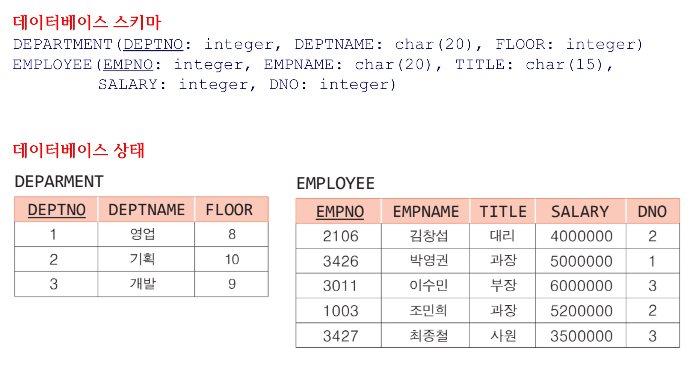

# 데베

- 측정해서 얻은 값들을 데이터, 가공 시 정보
- 정보가 다시 데이터로 쓰일 수도 있음
- 데이터 베이스와 카탈로그 사이에 독립성이 확보되어야함.(영향을 주더라도 최소화)

# #1 데이터베이스 시스템

## #1.1 데이터 베이스 시스템 개요

- def of Database : 조직체의 응용 시스템들이 **공유**해서 사용하는 방대한 **운영데이터**들이 **구조적으로 통합**된 모임.
- 측정해서 얻은 값들을 데이터, 가공 시 정보
- 정보가 다시 데이터로 쓰일 수도 있음
- Database의 **특징**
    1. 여러 부서에 속하는 **여러 사용자가 동시에 사용**
    2. 데이터가 **중복을 최소화**하면서 **통합**됨
    3. **운영 데이터** 뿐만 아니라, 그 **데이터에 관한 설명(메타데이터(metadata))까지 포함**됨
    4. 프로그램과 데이터 간의 **독립성**이 제공됨
    5. **효율적으로 접근**이 가능하고 **질의**를 할 수 있음 ⇒ ex) SQL
    
    시스템 개요
    
    
    
    1. 스키마
        1. 데이터 베이스의 **구조**를 뜻하며, **자주 변경되지 X**
        2. **모든 가능한 상태를 미리 정의**(ex) 현실세계에서 나이가 2000살은 안 되듯이)
        3. **내포(intension)**이라고 부름.
    2. 상태
        1. 특정 시점의 데이터베이스 **내용**을 의미하며, **시간이 지남에 따라 계속해서 바뀜**
        2. **외연(extension)**이라고 부름
    
    - 구분
        1. **시스템 카탈로그(데이터 사전)** : 메타데이터를 포함한 스키마 정보를 유지
        2. **저장된 데이터베이스(내용들)** : 상태들을 저장 
    
    - 데이터 베이스는 디스크와 같은 **보조 기억 장치에 저장**되나, DBMS로 **원하는 정보들을 찾기 위해서는 디스크의 블록들을 주기억 장치로 읽어**들여야 하고, 계산이나 비교 연산들을 수행하기 위해 CPU가 사용됨.

- **요구사항**
    1. 데이터의 **독립성** ⇒ 물리적,논리적 구조 변경에 대해 영향을 받으면, 유지보수 비용 상승되니까
    2. **대규모 데이터 저장**
    3. **효율적** 데이터 **접근**
    4. 데이터에 대한 **동시 접근**
    5. **백업**(따로 복사해놓는 것)과 **회복** ⇒ 문제가 생겼을 시, 해당 기간 동안에 발생한 질의 보관을 위해
    6. **중복을 줄이**거나 **제어**하며 일관성 유지
    7. 데이터 **무결성** ⇒ 스키마의 값에서 범위를 벗어난 값, 즉 잘못된 입력이 들어올 때, 사용자에게 재입력 요구 필요
    8. 데이터 **보안** ⇒ **권한**이 있는 사용자만 볼 수 있게
    9. **쉬운 질의어**
    
- 데이터 베이스 관리 시스템(**DBMS**)(Database Management System)
    - def) **데이터베이스(테이블들의 모임)을 정의**하고, **질의어를 지원**하고, **리포트를 생성**하는 등의 작업 수행하는 **소프트웨어 패키지**
    
    데이터베이스를
    
    1. 저장
    2. 관리
    3. 효율적 검색
    4. 시스템 고장이나, 권한이 없는 사용자로부터 안전하게 보호
    5. 동시 접근 제어
    6. 데이터 베이스 언어라 불리는 특별한 질의어 제공
    
    - **주기억 장치에 적재되어 실행**되어야함.

---

## #1.2 파일 시스템 vs DBMS

- 파일 시스템
    - 파일 시스템은 기존의 데이터 관리 방식(1960~)임.
    - 기본 구성 요소 : 바이트 스트림 or 레코드
        
        
        
    - 데이터에 대한 응용 프로그램 의존도가 높음(응용 프로그램 내에 상세히 데이터가 표시되기 때문)
    
    - **단점**
        1. 데이터가 많은 파일에 **중복 저장됨**
            
            + 추가 변경 사항이 있을 때, 두 시스템에 개별적으로 변경을 시켜야 됨. 안 시키면 정보 불일치 O ⇒ 오류 발생.
            
        2. **동시성 제어 X**
            
            저장한 시간 순으로 파일이 남아있게 됨.
            
        3. **질의어 제공 X**
        4. **보안** 조치가 **미흡** ⇒ 권한에 대한 검증 문제
        5. **회복 기능 X**
            
            ex) ctrl+S 안 누르면 끝!
            
        6. 데이터의 **독립성이 없**으므로 **유지보수 비용이 많이** 소요됨.
        7. 프로그래머의 **생산성이 낮음**
            
            질의어가 없어서 추가 함수를 만들어야됨.
            
        8. 데이터의 **공유 부족**
- DBMS
    - DB 관리 방법
        1. **여러** 사용자/응용 프로그램들이 **데이터 베이스 공유 ⇒ 동시성 확보**
        2. 사용자의 **질의를 빠르게 수행할 수 있는** 인덱스 등의 접근 경로 **자동적으로 선택하여 수행**
        3. **권한이 없는** 사용자로부터 데이터베이스를 **보호**
        4. **무결성 제약조건**을 **자동적으로 유지**
        5. 시스템이 고장 나면 데이터베이스를 고장 전의 일관된 상태로 **회복**시킴
        6. **프로그램에 영향을 주지 않으면서** 데이터 베이스 **구조를 변경**할 수 있음.
            
            ⇒ **프로그램-데이터 독립성(program-data independence)**
            
    - ⇒ 그로 인한 장점들
        1. **중복성과 불일치 감소**됨.(중복이 줄어서 하나만 있게되니, 그것만 수정하면 됨.)
        2. 시스템을 **개발하고 유지하는 비용이 감소**됨.(필요한 기능들이 갖춰져 있음)
        3. **표준화**를 시행하기에 용이
        4. **보안**이 향상됨
        5. **무결성**이 향상됨
        6. 다양한 유형의 고장으로부터 데이터베이스를 **회복**할 수 있음
        7. 데이터베이스의 **공유와 동시 접근이 가능함.**
    - 선정 시, 고려사항 들
        1. 기술적 요인 : 사용되고 있는 데이터 모델, 언어, 응용 개발 도구, 저장 구조 등
        2. 경제적 요인 : **SW/HW 구입 비용**, **유지 보수 비용**(구입한 것에 대한), 직원들의 **교육 지원**(새로운 것이다 보니) 등
    - 단점
        1. 추가적인 HW 비용+DBMS 자체 **구입 비용** 꽤 비쌈
        2. 직원들 **교육 지원 비용** 부담
        3. **비밀과 프라이버시 노출 등 단점 존재** ⇒ **정보가 한 곳에 몰려있어서** 여기가 털리면 정보 노출 가능성이 있음.
        4. 다음과 같은 상황일 때, DBMS 사용이 바람직하지 X
            1. **초기 투자 비용이 너무 클 때**
            2. 응용이 **단순**+잘 정의되어 **변경되지 않을 것**으로 예상될 때
            3. **엄격한 실시간 처리** 요구사항 **O**
            4. **다수 접근** 제어 필요 **X**

---

## #1.3 DBMS 발전 과정

- 데이터 모델
    - 구성요건
        - **데이터 구조**(데이터 타입과 관계)
        - 이 구조 위에서 동작하는 **연산자**들
        - 데이터 모델의 **일관된 상태를 정의**하는 **무결성 제약조건**들
    
    - 분류
        1. **고수준 또는 개념적 데이터 모델**
            
            **사람이 인식하는 것과 유사**하게 데이터 베이스의 전체적인 논리적 구조를 명시
            
            ex) 엔티티-관계 데이터 모델, 객체 지향 데이터 모델
            
        2. **표현(구현) 데이터 모델**
            
            **최종 사용자가 이해**하는 개념이면서 **컴퓨터 내에서 데이터가 조직되는 방식과 멀리 떨어져 있지 X**
            
            ex) 계층 데이터 모델, 네트워크 데이터 모델, 관계 데이터 모델, 객체 관계 데이터 모델
            
        3. **저수준 또는 물리적인 데이터 모델**
            
            데이터베이스에 **데이터가 어떻게 저장되는가를 기술**
            
            ex) B+ 트리 인덱스, 해싱 등
            

- **발전 과정**
    
    
    
    1. 계층 데이터 모델
        - 최초의 계층 DBMS 등장 (1960 후반)(ex) IBM사의 IMS)
        - **트리 구조를 기반** ⇒ 데이터를 노드로 생각
        - 장점
            - 어떤 유형의 응용에 대해서든 빠른 속도와 높은 효율성을 제공
        - 단점
            - 어떻게 데이터에 접근할 지를 **응용 프로그램에 미리 정의해야됨**
            - 데이터베이스가 생성될 때, **각각의 관계를 명시적으로 정의**해야함
            - **레코드들이 링크로 연결**되어 있으므로, 레코드 **구조를 변경하기 어려움** ⇒ 각각이 포인터, 주소로 연결됨
        
        
        
    2. **네트워크 데이터 모델**
        - **그래프 기반**으로 변경!
        - 단점
            - **구조가 복잡**해지고, 무결성 확보가 어려워짐.
                
                
                
            
    3. **관계 데이터 모델**
        - in **1970**, **E.F.Codd**가 IBM 연구소에서 관계 데이터 모델을 제안
        - 미국 IBM 연구소에서 진행된 **System R(⇒관계데이터 모델)**과 캘리포니아 버클리대에서 진행된 **Ingres(Ingres라는 시제품을 발매하고, !!!!객체 관계 DBMS(Postgre SQL)!!!을 후에 만듦!)** 프로젝트
        - 장점
            - **모델이 간단 ⇒ 이해하기 쉬움** +⇒계속해서 발전을 거듭함. 이후에 나온 것들이 다 관계 데이터 모델을 뿌리로 함.
            - 사용자는 **자신이 원하는 것(what)만 명시**하고, 데이터가 **어디**에 있는지/**어떻게 접근**해야하는 지(how)는 **관계 DBMS가 결정**
            
            
            
    4. **객체 지향 데이터 모델**
        - 1980년대 후반 들어 새로운 데이터 모델인 객체 지향 데이터 모델이 등장
        - **객체 지향 프로그래밍 패러다임을 기반**으로 하는 데이터 모델
            
            ex) 상속 등
            
        - 장점
            - 데이터와 프로그램 **그룹화**
            - 복잡한 객체들을 이해하기 쉬움 ⇒ **오히려 일반적인 상황에선 잘 안 쓰임.**
            - **유지와 변경 용이**
        - ex) db4o(오픈소스), GemStone, ObjectBox 등
        
    5. **객체 관계 데이터 모델**
        - **1990년대 후반**에 **관계 DBMS + 객체 지향 개념** 인 모델이 제안됨
        - ex) **Oracle,** **PostgreSQ**L 등
            
            
            
    6. **NoSQL 데이터베이스**
        - 2000년대에 들어서 메타, 엑스와 같은 소셜 미디어와 웹 데이터(구글)가 폭발적으로 증가하면서 **반구조적**(구조가 느슨히 정의, JSON, XML 등)/**비구조적**(이미지 등) **빅데이터를 다룰 필요성 대두됨.**
        - **N**ot **O**nly **SQL**
    
    - 발전과정을 거치며, **프로그래머가 DB를 관리해야될 분량이 줄어, 생산성이 올라감.**
- **이후에 여러 목적에 맞는 DB가 생겨나**고,(CAD DB, SW 공학 DB(재사용 가능 SW 라이브러리), 게놈 DB 등) **고급 UI를 지원**(SQL, **자연어**, 폼 기반 등)

---

## #1.4 DBMS 언어

DDL, DML, DCL 3가지가 존재

1. **DDL**(데이터 정의어, Data Definition Language)
    - **데이터 베이스 스키마를 정의**
        
        ex) table, index 등
        
    - DDL로 명시된 문장이 입력되면, DBMS는 사용자가 정의한 **스키마**에 대한 내용을 **시스템 카탈로그에 저장.**
        
        ex) in SQL
        
        - 생성 : CREATE TABLE
        - 변경 : ALTER TABLE
        - 삭제 : DROP TABLE
        - 접근을 위한 인덱스 정의 : CREATE INDEX
2. **DML(**데이터 조작어, Data Manipulation Language)
    - DB 내의 원하는 데이터를 검색, 수정, 삽입, 삭제
    - RDBMS에서 사용되는 SQL은 대표적 비절차적 언어
    - 대부분 SUM, COUNT, AVG와 같은 집단 함수를 가짐.
    - 단말기에서 대화식으로 입력되거나, or 고급 프로그래밍 언어(C, Java)로 작성된 프로그램에 내포되어 사용됨
    
    ex) in SQL
    
    - 검색 : SELECT
    - 수정 : UPDATE
    - 삭제 : DELETE
    - 삽입 : INSERT
    - 저장된 데이터 베이스에 적용됨.
3. **DCL**(데이터 제어어, Data Control Language)
    - DB **트랜잭션(작업단위)을 명시**하고 **권한**을 부여하거나 **취소**

---

## #1.5 DBMS 사용자

1. **데이터 베이스 관리자(DBA** : Database Administrator)
    
    ⇒ 조직의 여러 부분의 **상이한 요구를 만족**시키기 위해서 **일관성 있는 데이터베이스 스키마를 생성하고 유지**하는 사람(팀)
    
    - 역할
        1. DB **스키마의 생성**과 **변경**
        2. **무결성 제약조건**을 명시
        3. 사용자의 **권한을 허용**하거나, **취소**, **역할을 관리**
        4. **저장 구조**와 **접근 방법(물리적 스키마) 정의**
        5. **백업** & **회복**
        6. **표준화** 시행
    
2. **응용프로그래머**
    - DB 위에서 특정 **응용 프로그램(**인사 관리 프로그램 등)이나 **인터페이스를 구현하는 사람**
    - C, Java 등으로 응용 프로그램 개발하면서 **DB 접근하는 부분**은 내포된 **DML 사용**
    - 만들어낸 프로그램은 최종 사용자들이 **반복하여 수**행되므로, **기작성 트랜잭션(canned transaction(작업))**이라 부름.
    
3. **최종 사용자(end user)**
    - **질의 or 갱신**하거나 **보고서를 생성**하기 위해서 데이터베이스를 사용하는 사람
    - DB 질의어를 사용해,
        - 캐주얼 사용자 : 매번 다른 정보를 찾음
        - 초보 사용자 : 기작성 트랜잭션을 주로 반복하여 수행
        
4. **DB 설계자**
    - ERWin 등의 CASE 도구들을 이용해서 **DB 설계를 담당**
    - DB의 **일관성을 유지**하기 위해서 **정규화**를 수행
    
5. **오퍼레이터**
    - DBMS가 운영되고 잇는 컴퓨터 시스템과 전산실을 관리하는 사람
        
        ⇒ **DBMS를 위한 하드웨어 관리하는 사람**
        

최근에는 4,5가 묶여서 같이 수행되기도 함.

---

## #1.6 ANSI/SPARC 아키텍처와 데이터 독립성

- 현재 대부분의 RDBMS 구현에서 사용되는 일반적은 architecture는 1978년에 제안된 이것이다.
- Abstract한 구조임. 외부 view에서는 how를 생각할 필요 X, 그저 필요한 정보를 요청하기만 하면 됨.


- 3단계로 나눠짐
    - **외부** 단계(external view) : 각 사용자의 뷰
        - 여러 부류의 사용자를 위해 동일한 개념 단계로부터 **다수의 서로 다른 뷰가 제공**될 수 있음.
        - generally, 최종 **사용자와** **응용 프로그래머들**은 **DB 일부분만 관심을 가짐.**
        
        **⇒ 굳이 외부 view에서 개념 단계의 모두를 볼 필요 X ⇒ Abstract한 structure**
        
    - **개념** 단계(conceptual level) : 사용자 공동체의 뷰
        - 조직체 **전체에 관한 스키마를 포함**
        - what에 관한 정보를 주로 저장
            
            어떤 데이터 저장?
            
            데이터 간의 관계는?
            
            어떤 무결성 제약 조건들이 있는 지?
            
        - DB에 대한 **사용자 공동체의 뷰**를 나타냄
        - **DB마다 오직 1개의 개념 스키마 존재**
        
        **⇒ end user가 요청할 수 있는 모든 정보들을 모아놓음.**
        
    - **내부** 단계(internal level) : 물리적 또는 저장 뷰
        - 데이터의 **물리적인 저장 구조에 대한 스키마**
            
            **⇒ 개념 스키마의 정렬 방식만 저장!**
            
        - DB에 **어떤 데이터**가 **어떻게 저장**되어 있는가를 기술함.
        - 인덱스, 해싱 등과 같은 **접근 경로 등을 기술**함.
        - 데이터베이스의 **개념 스키마에는 영향을 미치지 않으면서,** **성능을 향상시키기 위해 내부 스키마를 변경**하는 것이 바람직.
        - **내부 단계 아래(디스크)**는 물리적 단계 ⇒ **OS가 관리**함.

- 사상(mapping)
    - **외부/개념 사상**
        
        외부 단계의 뷰를 사용해서 입력된 사용자의 질의를 개념 단계의 스키마를 사용한 질의로 변환
        
        ⇒ **질의 전환해서 개념 스키마의 것에 mapping하는 것**
        
    - **개념/내부 사상**
        
        이를 다시 내부 단계의 스키마로 변환하여 디스크의 데이터 베이스를 접근
        
        ⇒ **다시 또 mapping하여, 그 하부에 있는 디스크에 접근**
        
- 데이터 독립성
    
    상위 단계의 스키마 정의에 영향을 주지 않으면서, 어떤 단계의 스키마 정의를 변경할 수 있음을 의미
    
    
    
    1. **논리적 데이터 독립성**
        - 개념 스키마의 변화 →  외부 스키마가 영향 X
        - 기존의 외부 뷰에 영향을 미치지 않고. 응용 프로그램을 다시 작성할 필요 없이 개념 스키마에 대한 변화가 **가능해야함**.
        
        **⇒ 개념 스키마의 내용을 바꿔도, mapping이 되어있어서, 문제가 없게 됨.**
        
    2. **물리적 데이터 독립성**
        - 내부 스키마의 변화가 개념 스키마에 영향을 미치지 않으며, 따라서 외부 스키마(또는 응용프로그램)에도 영향을 미치지 않음을 의미
        - ex) **파일의 저장 구조를 바꾸거나 인덱스를 생성 및 삭제**

---

## #1.7 데이터베이스 시스템 아키텍처


1. **데이터 정의어 컴파일러(DDL compiler) 모듈**
    - **DDL을 사용**해, 요청이 들어오면 **table을 DB에 만들고**, **이에 대한 명세를 시스템 카탈로그에 저장.**
    
2. **질의 처리기(query processor) 모듈**
    - DML을 수행하는 최적의 방법을 찾는 모듈을 통해서 기계어 코드로 번역. **질의 최적화기(query optimizer)**
    
3. **런타임 데이터베이스 관리기(run-time database manager) 모듈**
    - **디스크에 저장된 DB를 접근**
        
        
4. **트랜잭션 관리(transaction management) 모듈**
    - **동시성 제어** 모듈
    - **회복 모듈**

- **데이터베이스 API**
    - **ODBC**(Open Database Connectivity) : MS에서 주도적으로 개발한 것
    - **JDBC**(Java Database Connectivity) : Java가 운영되는 플랫폼에서 지원되는 것
    
    둘 중 하나를 지원하는 DBMS 간에는 **서로 상대방의 DB를 접근할 수 O**
    

1. **중앙 집중식 데이터베이스 시스템(centralized database system)**
    - DB system이 하나의 컴퓨터 시스템에서 운영됨.
        
        ⇒ traffic이 몰려, 성능이 좋은 걸 사야되는 순간이 왔을 때, 가격이 너무 비쌈.
        
        10k 수용 : 10만원
        
        100k 수용 : 1000만원 등
        
2. **분산 데이터베이스 시스템(distributed database system)**
    - **네트워크로 연결된** 여러 사이트에 **데이터베이스 자체가 분산되어 있으며,** 데이터 베이스 시스템도 **여러 컴퓨터 시스템에서 운영**됨.
        
        ⇒ 10k 10개 : 100만원 < 100k 1개
        
        중앙 집권적 시스템의 단점 해결.
        
    - 사용자는 **다른 사이트에 저장된 데이터 베이스도 접근 가능**
        
        how ⇒ **for network!**
        

- **클라이언트-서버 데이터베이스 시스템(client-server database system)**
    - PC, 노트북, 스마트폰처럼 **자체 컴퓨팅 능력을 가진** 클라이언트를 통해 데이터베이스 서버를 접근
        
        ⇒ **서버가 A to Z를 하지 않고, 클라이언트가 A to H 정도 해서 서버 부하를 낮춤.**
        
        ex) 배민에서 직접 먹을 것을 골라담고 이것을 배달 버튼을 통해 요청!
        
    - DB가 하나의 서버에 저장
    - DB 기능이 분산됨(클라이언트, 서버로)
    - 서버 역할
        - DB 저장
        - DBMS 운영
        - 질의 최적화
        - 권한 검사
        - 동시성 제어
        - 회복
        - 무결성 유지
        - 접근 관리
        
        **기존에 DBMS에서 강조되던 것들**
        
    1. 2층 모델(2-tier model)
        - 응용 논리가 클라이언트와 서버에 흩어져 있음
    2. **3층 모델(3-tier model)**
        - 클라이언트와 데이터베이스 서버 사이에 **응용 서버 추가됨**
        - 응용 논리가 응용 서버에만 포함돼있음
            
            
            
    - 장점
        - DB를 보다 **넓은 지역에서 사용 가능**(for server)
        - 다양한 컴퓨터 시스템을 사용할 수 O
    - 단점
        - **모든 클라이언트**에서 **새 버전을 동시에 다운로드**하여 설치하는 것이 **어려울 수 있음** ⇒ **3-tier model에서 개선됨!**
        - **보안 다소 취약 ⇒ 네트워킹 돼있는 거 중간에 낚아채면 끝이기에**

- **주기억 장치 데이터베이스 시스템**
    
    **⇒ 모두 RAM으로 올림. ⇒ 램 디스크 왔다갔다 인 io가 제일 느리기 때문에 이를 개선.**
    
    - **데이터베이스를 주기억 장치(RAM)에 주로 저장하고 관리**
    - 빠른 응답 시간을 요하는 분야에서 사용하는 경우 많음
- **클라우드 데이터베이스 시스템**
    - **클라우드 컴퓨팅 플랫폼에서 운영됨**
    - VM image를 사용해 클라우드에서 독립적으로 데이터베이스를 실행하거나 클라우드 데이터베이스 공급자가 유지관리하는 데이터베이스 서비스에 대한 접근 권한을 구매할 수 있음.

---

# #2 관계 데이터 모델과 제약조건

- 최초 RDBMS 구현 모델은 SystemR(from IBM 연구소)
- E.F.Codd가 in 1970, 제안함.
- ORACLE, MySQL 등
- RDBMS 성공요인
    - 간단한 릴레이션(table) 사용
    - 중첩된 복잡 구조X
    - 한 번에 레코드들의 집합 처리
    - SQL 제공 ⇒ 숙련도와 무관하게 이해 가능
    - 이론이 잘 정립돼, 안정성 $\uparrow$

## #2.1 관계 데이터 모델의 개념

- RDBMS
    - 동일한 구조(릴레이션) 관점에서 모든 데이터 **논리적으로 구성.**
    - 선언적인 질의어(**SQL)을 통한 데이터 접근을 제공**
    - 응용 프로그램(**외부**)-레코드들의 순서(**내부**) : **무관**
    - **사용자는 what만 알고, how는 몰라도 됨.**
    - 링크나 포인터 사용X, **key를 사용함**

- 기본용어
    
    
    
    - **relation** : 2차원 table, tuple 들의 집합
    - **record** : relation의 각 행
    - **tuple** : record를 더 official하게 부르는 용어
    - **attribute** : relation에서 이름을 가진 하나의 column
    - **domain** : 한 attribute에 나타날 수 잇는 값들의 집합
        - 데이터 타입과 유사
        - 동일 도메인이 여러 attribute에서 사용될 수 있음.
            
            위에서 EMPNO와 SALARY가 INTEGER로 같듯이
            
        - 원자값이다(더이상 나눌 수 X)
    - **degree(차수)**
        - 한 relation에 들어 있는 attribute의 수(# of 스키마 구성요소)
        - **최소 차수 : 1** ⇒ 0이면 relation도 없는 것.
        - 자주 바뀌지 X
    - **cardinality(카디날리티)**
        - 최솟값 0 가능! ⇒ 최초 상태 or 상태를 모두 지워버린 즉, 비어있는 상태면 0 가능.
        - 시간이 지남에 따라 변함
    
    
    
    - **null(널)**
        - ‘알려지지 않음’ or ‘적용할 수 없음’ 등 **미정의 값**을 나타내기 위해 null 사용.
        - **DBMS마다 null 표시를 달리 함.**
        - **숫자 도메인의 0이나, 문자열 도메인의 공백과는 다름!**
    - **relation schema**
        - relation의 **이름과 attribute들의 목록**
        - relation을 위한 **framework**
        - **기본 키 밑에는 밑줄 표시**
        - 그냥 **기존에 알던 schema보다 더 좁아진 개념일 뿐 틀은 비슷.**
        - intension(내포)라고도 함.
            
            
            
    - **relation instance**
        - 어느 시점에, relation 속 **tuple들의 집합**
        - **계속 변함**
            
            **⇒ 현재의 instance만 저장됨**
            
        - 그냥 **기존에 알던 instance랑 비슷.**
        - extension(외연)이라고 함
    - **관계 데이터베이스 schema**
        - 1개 이상의 relation schema로 이루어짐
        
        
        
    - **관계 데이터베이스 인스턴스**
        - 1개 이상의 relation instance들의 모임으로 구성됨
        
        
        

---

## #2.2 릴레이션의 특징

1. 각 relation은 오직 하나의 record 타입만 포함
2. **한 attribute 당 하나의 도메인**
3. **동일 tuple이 2개 이상 존재 X**
    
    ⇒ **key**가 존재
    
4. **tuple/attribute들의 순서는 중요하지 않음**
5. 각 attribute는 **원자값**을 가짐
6. DB schema내에 **다른 relation에 동일한 이름 있어도 O**
    
    ⇒ but, **한 relation에서 각 name** of attribute는 **고유!**
    

---

## #2.3 릴레이션의 키

**Key**

각 tuple을 **고유하게 식별**할 수 있는 1개 이상의 attribute 모임

1. **슈퍼 키**
    - 한 relation 내의 **특정 tuple을 고유하게 식별**하는 **한 개 이상의 attribute들의 모임.**
    - **꼭 필요하지 않**은 attribute여도 모임에 **포함 가능**
    - ex) in 신용카드 회사의 고객 relation
        - (신용카드번호, 주소)
        - (주민등록번호, 이름)
        - (주민등록번호)

1. **후보 키**
    - 각 tuple을 고유하게 식별하는 **‘최소한’의** attribute들의 모임
    - **all relation has at least more than 1 후보 키!**
    - **복합키(composite key)**
        - 두 개 이상의 attribute로 이루어진 후보 키
        - ex) (학번,과목번호)
        
        
        
    
2. **기본 키**
    - 한 relation에 **후보 키가 2개 이상 있을 때**, DB **Administrator** or **Architect**가 **이들 중 하나를 기본 키로 선정.**
    - ex) in 신용카드 회사의 고객 relation
        - (신용카드번호), (주민등록번호) 중 하나를 택하는 것.
    
3. **대체 키**
    - **기본 키로 채택되지 않은 것들**
    - in 신용카드 회사의 고객 relation
        - (신용카드번호) : 기본키
        - ⇒ (주민등록번호) : 대체키
        
        반대도 가능!
        
    
4. **대리 키**
    - 자연스러운 기본 키를 찾아낼 수 없을 때, 종종 인위적인 키 attribution을 relation에 추가할 수 있음
    - ex) ISBN, 주민등록번호, 학번
    
    
    

1. **외래 키**
    - **어떤(다른/자체) relation의 기본 키를 참조하는 attribute**
        1. **다른** relation의 기본 키를 참조하는 외래 키
            
            
            
        2. 자체 relation의 기본 키를 참조하는 외래 키 
            
            
            
        3. 기본 키의 구성요소가 되는 외래 키
            
            
            
        
    - tuple을 고유하게 **식별하는 기능은 X**
    - RDB에서 relation간의 관계를 나타내기 위해 사용됨.
    - 외래 키 attribute의 domain = 참조되는 relation의 기본 키의 domain

---

## #2.4 무결성 제약조건

- **데이터 무결성(data integrity)**
    - 데이터의 **정확성 또는 유효성을 의미**
    - **일관된** DB상태를 정의하는 규칙들을 묵시적 or 명시적으로 정의
    - DB가 **갱신**될 때 **DBMS가 자동적으로 무결성 제약조건을 검사**하므로 **응용 프로그램들은 무결성 제약조건을 검사할 필요가 X**
        
        ex) PW 자릿수가 4자리로 고정돼있는데, 그 초과값이 들어오면 거절하는 등
        

- **무결성 제약조건**
    1. **도메인 제약조건(Domain Constraint)**
        - 각 **attribute 값**이 반드시 **원자값**이어야 함.
        - 데이터 타입을 통해 값들의 **유형**(정수형, 문자형 등)을 **제한**할 수 있음
        - attribute의 default값, *CHECK 제약 조건(나중에 SQL때 설명해준다고 하심.)*을 통해 값들의 범위를 제한할 수 있음.
        
    2. **키 제약조건(Key Constraint)**
        - key attribute에 중복된 값이 존재해서는 안 됨.
        - 기본키에 한정된 것이 아닌, 모든 key에 대한 제약조건.
    
    1. **기본키와 엔티티 무결성 제약조건(entity integrity constraint)**
        - relation의 **기본 키를 구성하는 어떤 attribute도 null을 가질 수 X.**
        - 대체 키에는 적용 X
        - **사용자**는 relation을 생성하는 **데이터 정의문**에서 어떤 attribute가 relation의 **기본 키의 구성요소인가를 명시**
        
    2. **외래키와 참조 무결성 제약조건(referential integrity constraint)**
        
        💡  **없는 것을 참조할 수는 X ⇒ 참조 가능한 범위 : 참조하는 곳에 있는 것들 + NULL**
        
        
        
        ⇒ 위 같은 상황에서 수강 table에 (NULL CSE101 A0)를 넣으면 X
        
        ⇒ Why? ⇒ **엔티티 무결성 제약조건** 때문에
        
        - 두 relation의 연관된 tuple들 사이의 일관성을 유지하는데 사용됨.
        
        - **유지 조건**
            - 갱신 연산은 1. 삽입, 2. 삭제, 3. 수정 연산으로 구분
            - DBMS는 외래 키 or 기본 키가 **갱신**됐을 때, **참조 무결성 제약조건이 위배되지 X도록 해야됨.**
            
            
            
            - **삽입**
                - 참조되는 relation에 대해서는 위배되지 X
                - 참조하는 realtion에 대해서는 위배할 **수** 도 O
                    
                    ex) 위의 경우, 1156 홍길동 **6**이 들어가게 되면 위배됨.
                    
            - **삭제**
                
                
                
                - 참조되는 relation에서 tuple이 삭제될 시, 참조 무결성 제약 조건을 위배하는 경우가 생길 **수** 도 있음.
                - 참조하는 relation에 대해서는 위배되지 X
            - **수정**
                - DBMS는 수정하려는 attribute가 기본 키인지 외래 키인지 검사함.
                - 수정 대상이 기본 키/외래 키 X라면, 무결성 제약조건을 위배 X
                - **사실상 수정 : 삭제+삽입이니, 밑에 있는 옵션들은 동일하게 적용됨.**
        
        - **조건 만족을 위해 DBMS가 제공하는 옵션**
            1. **제한(restricted)**
                - 위배를 야기한 연산을 **단순히 거절.**
                    
                    ex) 삭제 ex)과 같은 상황을 거절.
                    
            2. **연쇄(cascade)**
                - 참조되는 relation에서 tuple 삭제
                    
                    +⇒ 참조하는 relation에서의 참조하는 tuple**도 삭제**
                    
                    ex) 그림 2.16에서처럼, **개발부서**를 삭제시키면, 이를 참조하는 **이수민, 최종철씨**도 삭제하는 것.
                    
            3. **널(NULL)**
                - 참조되는 relation을 tuple에서 **삭제하고**, 참조하는 relation에서 이 tuple을 참조하는 tuple들의 외래 키에 **널을 삽입**.
                    
                    ex) 위 상황에서 개발 부서가 삭제된다고 했을 때, 연쇄에 의해 이수민, 최종철을 삭제하는 것이 아닌, 그들의 DNO값에 ^(NULL)을 삽입하는 방식
                    
            4. **디폴트 값(Default)**
                - **NULL이 들어가는 대신에 default값을 넣는 것.**
        
        - Quiz
            
            
            
            위 같은 상황에서 다음과 같은 조건이 있을 때, 1,2,3의 수행이 되나?
            
            - EMPNO : 4자리 N
            - EMPNAME : char(6)
            - FLOOR < 12
            - DEPTNAME : 중복 불가
            
            1. 1106, 김태연, 4 ← EMPLOYEE에 추가 ⇒ (O)
            2. 11003,홍길동, 3 ← EMPLOYEE에 추가 ⇒ (X)
                
                ⇒ domain 제약조건 위배
                
            3. 5,영업, 7 ← DEPT 추가 ⇒ (X)
                
                ⇒ key 제약조건 위배
                
        

---

# #3 관계 대수

## #3.1 관계 대수의 개요

- 관계 해석(relational calculus)
    
    원하는 데이터만 명시
    
    ⇒ 질의 수행에 관한 건 명시 X
    
- **관계 대수(relational algebra)**
    - 관계 연산자들이 수행되는 순서를 명시한 절차적 언어
        
        **⇒ 질의 수행에 관한 걸 명시**
        
    - SQL의 기초
    - RDBMS는 SQL질의를 DBMS 내부에서 관계 대수식으로 변환 후, 이를 바탕으로 최적의 질의 수행계획 찾음.
    - **기존의 relation으로부터 새로운 relation 생성**
    - 관계 연산자들의 집합으로 이루어짐
    
    
    
    
    
    아래에서 상세히 함
    
    - 단일 or 2개의 relation을 입력으로 받아, 결과 relation을 생성함.
        
        
        
    

---

## #3.2 필수적인 관계 연산자

1. **셀렉션 연산자(selection)**
    
    
    
    - 해당 **조건(프레디키트**(predicate))을 만족하는 **tuple들의 부분 집합**을 생성함.
        
        ⇒ 조건은 임의의 attribute, 상수, {=,**<>**,<=,<,>=,>}등의 비교 연산자, {AND, OR, NOT}등의 boolean 연산자를 포함.
        
        ⇒ <> : 크지도 작지도 않다 ⇒ 아니다(≠)의 의미
        
    - 단항 연산자
    - 차수 : 변함 X
    - cardinality ≤ 기존 cardinality
        
        ⇒ 같아지는 때는, 모든 tuple들의 조건을 만족시킬 시.
        
    
    ex)
    
    
    
    → ex2) DNO가 2번이 아닌 사람들 : $\sigma_{DNO<>2}(EMPLOYEE)$
    

1. **프로젝션 연산자**
    
    
    
    - 해당 attribute들의 부분 집합
    - 프로젝션 연산의 결과 relation에는 중복된 tuple들이 존재할 수 있음!
        
        ⇒ 결과적으론 중복을 제거해줌
        
        ⇒ WHY? 결과적으로 나온 얘는 만약 attribute가 하나라고 하더라도, relation인 것임.
        
        relation은 중복된 값을 가지면 안 되기에, 마찬가지로 중복제거해줌.
        
        ⇒ cardinality ≤ 기존의 것
        
        
        
        
        

- Quiz


- **집합 연산자**
    
    결국 relation도 tuple들의 집합.
    
    **⇒ 집합 연산자도 적용이 됨.**
    
    - 종류
        - 합집합
        - 교집합
        - 차집합
    
    1. **합집합**
        - 합집합 호환
            
            두 릴레이션 R1(n attributes), R2(m attributes)가 합집합 호환이 될 필요충분조건
            
            1. **n=m**
            2. 합쳐지는 **도메인**이 같아야됨.(이름이 같을 필요는 X, domain이 같아야됨.)
        
        - 연산자 ⇒ $\cup$
        - 중복된 tuple은 제외됨.
        - attribute의 이름은 R1 or R2에서의 이름과 같음.
        
        
        
        
        
        RESULT1의 attribute 이름이 DNO 였어서 DEPTNO 대신에 DNO 써도 무관!
        
    
    1. **차집합**
        - 연산자 : -
        - 집합 연산의 -와 완전히 동일.
        - 차집합도 합집합 호환이 되지 않으면, 연산 불가능!
        
        
        
        
        
    
    1. **카티션 곱 연산자**
        - 연산자 : $\times$
        - $R(a_i|i\in[1,n], i\in N)$  (cardi : i)과 $S(a_j|j\in[1,m], j\in N)$(cardi : j)를 카티션 곱하면,
            
            **⇒ 차수 : n+m**
            
            **⇒ cardinality : i*j**
            
            인 relation이 나옴.
            
            **⇒ R과 S의 tuple들의 모든 가능한 조합으로 이루어진 relation!**
            
            ⇒ 결과 relation은 굉장히 클 것이며, 실제로 원하는 건 전체의 일부인 경우가 대부분!
            
        
        
        

- Quiz
    
    
    
    - 만약 지역이 수원인 사람이 10명 있었으면, 1번에서 첫 연산시 가져오는 것은 10*1000짜리 정보들임
    - 그런데 2번에서는 첫 연산시 가져오게 되는 것이 100*2로 더 작아짐.
    - 하지만 1,2번 둘 다 결과는 같음 ⇒ **방식에 따라 성능이 더 높아질 수도 있는 것!**
    - **실제론 DBMS에서 알아서 최적으로 해주긴 함.**

- Quiz
    
    
    
    차수 2에 카디널리티 9짜리 릴레이션 생성
    
- 관계대수의 완전성
    
    셀렉션, 프로젝션, 합집합,차집합, 카티션 곱을 통해 표현가능하면, **관계적으로 완전**하다고 함.
    

---

## #3.3 유도된 관계 연산자

- **교집합 연산자**
    
    
    $$
    T = R\cap 
    S
    $$
    
    $$
    	0<=d(T)<=min(d(R),d(S))
    
    $$
    
    $$
    R\cap S = R-(R-S
    )
    $$
    
    등으로 유도!
    
    
    
    
    
    
    
- **조인 연산자**
    - 두 개의 릴레이션으로부터 연관된(조건을 줘서) 튜플을 결합하는 연산자
    - 교환법칙이 성립함.
        
        ex) A*B*C = B*C*A 등
        
        조건에 따라서 어떨 땐 사라지고 어떨 땐 안 사라지는 튜플들이 있다고 생각했으나, 어짜피 나중에 그 조건을 만나서 사라질 애는 사라짐.
        
    - 종류
        - 세타/동등/자연/외부/세미 등
        1. **세타 조인$(\theta-join)$**
            
            
            
            - 두 릴레이션을 카티션 곱처럼 결합함(차수 : n+m)
                
                but, **조건을 두고** 결합
                
            - 세타에는 =,<>,< =, > =, > 중 하나
            - 만약 세타에 부등호가 들어가게 되면, 만족시키는 모든 것에 대해 경우의 수가 늘어나니, 원래 릴레이션보다 카디널리티가 커질 수 있음. 물론 원래보다 작아질 수도 있음.
            
        2. **동등 조인**
            - 세타가 =일 때, 세타 조인
            
            
            
            - 위와 같이 필수 연산자를 사용하여, 유도해서 얻어낼 수도 있음
            
            
            
        3. **자연 조인**
            - 동등 조인의 결과에서 조인 atrribute 한 개(겹치는 거)를 제외
            
            
            
            
            
            
            
        4. **디비전 연산자**
            
            
            
            - **RESULT2와 같이 모두 가지고 있는 경우만 결과로 도출해낸다**
                
                즉, b2,b4를 모두 가지고 있는 tuple만 뽑아내는 것.
                
                ex) 밑에서 2번째의 a4 b2와 b2,b4를 묶어내는 것은 X. ⇒ a4가 b2를 가지지 못 함.
                
            - 차수 n+m인 릴레이션 R과 차수가 m인 릴레이션 S에 대해 R 중에 S에 해당하는 것들만 뽑아내서 결과로 도출!
            - 곱의 역이 성립하지 X.
                
                ⇒ $R\times S = T$ → $R=T\div S$는 성립.
                
                ⇒ but, $R=T\div S$ → $R\times S = T$는 **성립 X**
                
            
            
            
            - 관계 대수 질의의 EX)
            
            
            
            
            
            결과적 동등(결과는 같은데 과정이 다름)
            
            
            
            그냥 침착하게 생각하면 됨. 필수연산자만 사용해서 쓰는 것도 각 조인 연산자 부분만 카티션 곱으로 바꾸면 되니까 그냥 침착하면 됨.
            
        5. 외부 조인
            1. 왼쪽 외부 조인
            2. 오른쪽 외부 조인
            3. 완전 외부 조인
            
        6. 세미 조인

---

## #3.4 관계 대수의 한계 및 추가된 관계 연산자

- 한계
    - 산술 연산 X(집단 함수 지원 X)
    - 정렬 X
    - DB 수정 X
    - 프로젝션 연산시, 중복된 값 표현 X
- 집단 함수 ⇒ 사용법 ex) for SUM : $SUM_{salary}(EMLOYEE)$
    - SUM
    - AVG
    - COUNT(사용된 ,tuple의 수)
    - MAX
- **그룹화**
    
    
    
- 추가된 관계 대수 연산자
    1. 외부 조인
        
        조인 연산 과정에서 대응되지 못하고 **사라지는 것들을 포함**시키고, **없는 attribute에는 null**을 넣는 연산
        
        1. 왼쪽 외부 조인
            
            
            
        2. 오른쪽 외부 조인
            
            
            
        3. 완전 외부 조인
            
            
            
            
            

---

## 🚩예제+과제 문제들(Division 표현에 유의)


6번의 경우, 첫째줄과 같이, 필수연산자만 사용한 것은 밑에 사진과 같이 풀 수 있고,
다른 분이 grouping 사용하여 풀었다고 하는데, 복습할 때 다시 봐야할 듯. 


- 중요한 건 **‘전체’(모든 경우의 수)를 만들**어내고, 거기서, **이미 있는 경우의 수를 빼는** 것.
    
    이후엔 **이미 있는 경우**에서, **윗 줄에서 구한 값을 빼**는 것.
    
    This is **Divison!**
    


- 이전 문제와 같으나, ‘장르’라는 조건이 하나 더 붙어서 조금 더 드러워진 것 뿐!

---

# #4 SQL

## #4.1 SQL 개요

- 비절차적 언어(선언적 언어)로, what만 명시, how는 명시하지 X
- DBMS는 해당 질의를 효율적으로 처리하는 방법을 찾아냄.
- 두 가지 인터페이스를 가짐
    - 대화식 SQL
    - 내포된 SQL
- 구성요소
    - 정의어(DDL)
    - 조작어(DML)
    - 제어어(DCL)

## #4.2 데이터 정의어와 무결성 제약조건


- 스키마의 생성과 제거
    
    CREATE SCHEMA KIM_SCHEMA AUTHORIZATION KIM;
    
    생성한다 스키마를 ‘스키마이름’  권한은(주인은)          KIM이다
    
- 테이블 정의
    
    
    
- 테이블 정의에 따라 사용되는 데이터 타입
    
    
    
    SQL별로 이름이 다를 수 O
    
    DECIMAL(n,d)의 경우, 21.64는 (4,2)의 표현범위에 들어가고, 이 범위는 [-99.99 , 99.99]이다.
    
- 여러 정의어 examples
    - 테이블 제거
        - DROP TABLE DEPARTMENT;
    - ALTER TABLE
        - ALTER TABLE EMPLOYEE ADD COLUMN PHONE CHAR(13);
    - 인덱스 생성
        - CREATE INDEX EMPDNO_IDX ON EMPLOYEE (DNO);
    - 도메인 생성 ⇒ 지원 안 하는 DBMS가 있기도 하다.
        - CREATE DOMAIN DEPTNAME CHAR(15) DEFAULT ‘개발’;

- **제약조건들**
    
    
    
    1. NOT NULL
        
        칼럼에 NULL을 허용하지 않는다는 명시
        
    2. UNIQUE
        
        해당 칼럼이 대체키임을 명시⇒ key 무결성 제약조건 명시 가능
        
        **⇒ 중복을 허용하지 않는다는 의미!**
        
    3. DEFAULT
        
        칼럼의 특정 값이 주어지지 않을 시, default값을 넣음.
        
        ⇒ 만약 default 설정X, 주로 NULL로 저장됨.
        
    4. CHECK
        
        칼럼이 가질 수 있는 값들의 범위 지정
        
        
        
    


1. 기본 키 제약조건
    
    각 테이블마다 최대 한 개의 기본 키를 지정할 수 있음.
    
    기본 키에는 자동적으로 인덱스 생성됨.
    
    명시 방법 : PRIMARY KEY (’칼럼이름’)
    
2. 참조 무결성 제약조건
    
    
    
    - 명시 방법 : FORIEN KEY(’참조하는 칼럼’) REFERENCE ‘table이름’(’칼럼이름’)
    - 참조하는/되는 칼럼은 동일한 데이터 타입을 가져야함.

- 옵션
    
    
    
    - NO ACTION : 삭제 자체를 막음
    - CASCADE : 연쇄
    - SET NULL/DEFAULT : 삭제될 시에, 다른(참조하던/되던 값들에게) NULL/DEFAULT를 박음
        
        
        


## #4.3 SELECT문

가장 기본적인 형태 : ,SELECT-FROM-WHERE절


프레디키트 : 조건


- 필수적인 절
    - SELECT
    - FROM

1. SELECT
    - 위와 같이 DISTINCT를 사용해서 명시적으로 요청했을 때만 중복 제거
    
    ⇒ 원래는 중복제거 X ⇒ 즉, 원래는 카디널리티가 유지됨.
    
    - SELECT * : 해당 튜플의 모든 칼럼들을 검색하라는 의미
    
2. FROM
    - 필요로 되는 테이블 리스트를 열거

1. WHERE
    
    
    
    다음을 이용해, 조건을 명시
    
2. 중첩된 질의
    - 다른 질의의 WHERE절에 포함된 SELECT문
        
        EX) a사원의 월급보다 많이 받는 사원들의 이름 ⇒ 1: a사원의 월급 2: 1보다 많이 받는 사원들 이름
        
3. GROUP BY절
    - 명시된 칼럼에 동일한 값을 갖는 튜플들을 한 그룹으로 묶음.

1. HAVING절
    - GROUP BY절에서 묶여진 것들이 만족해야하는 조건

1. ORDER BY절
    - 결과 투플들의 정렬 순서를 명시
    - SELECT절의 맨 마지막에 와야함.
    - 기본 정렬 방식은 오름차순(ASC)
    - 정렬 순서는 앞에서부터 하나씩이고, ,(컴마)를 기준으로 내림차순 등을 커스텀 지정해줄 수 있음.
        
        ```sql
        select ...
        from ...
        where ...
        order by DNO, salary desc;
        #위 경우에 DNO로 오름차순 먼저 정리되고, 그 뒤에 겹치는 것들은 salary값을 내림차순으로 정렬시킴.
        ```
        

- **별칭(alias)**
    
    **서로 다른 테이블**에 **동일한 이름의 칼럼**이 속해있을 때, 칼럼의 이름을 구분하는 방법.
    
    
    
- **연결 연산자**
    
    두 개 이상의 칼럼을 합침!
    
    - 버티컬 바 두 개(||)를 통해서 표현
        
        ```sql
        SELECT FIRST_NAME|| ' , ' || Job_id as "NAME AND TITLE"
        from HR.EMPLOYEES
        ```
        
        중간에 문자열을 넣어서 extension에 표현되는 형식을 바꿔줄 수도 있다.
        
    
- **리터럴 문자열**
    - 일반적으로는 ‘’를 사용하지만, **띄어쓰기를 포함해주고 싶으면 “”(쌍따옴표**를 사용해야됨.)
    - 리터럴이란 SELECT절에 포함된 문자, 수식, 또는 숫자 등을 말한다.
    - 대소문자를 구분해줌
    
- **날짜**
    - 날짜값은 ‘’안에 들어감.
    - 기본형식
        - DD-MM-RR
    - where 절에 날짜등을 사용하고 싶으면, 
    TO_DATE(’원하는 날짜’,’포맷 방법 ex) /를 통한 구분 or .(dot)을 통한 구분’)을 사용.
    
    
    
- DBMS별 차이
    
    
    

실 내용은 갖지만,  DBMS마다 정렬방식이 다를 수 있음!

- **LIKE 연산자**
    - 문자열을 비교해주는 연산자
    - 대소문자를 구분해줌.
    1. % : 아래 예시와 같이 특정 문자 앞에 혹은 뒤에 붙여서 앞쪽은 뭐가 들어오든 (문자열의 크기는 0~infinite) 신경쓰지 않고, 받아오는 것.
    2. *_ (underbar) : 예를 들어 LIKE ‘동_ _ _’(실제로는 띄어쓰기 없이 모두 붙임) 의 경우, 동이라는 글자 뒤에 3글자가 들어오는 것까지만 받는 것. 그래서 총 4글자 받아오게 됨.*
    
    
    
    ```sql
    SELECT CUSTNAME
    FROM CUSTOMER
    WHERE ADDRESS LIKE '%동대문구%'
    ```
    
    
    
- 연산자들의 우선순위
    1. 비교연산자
    2. NOT
    3. AND
    4. OR

- **부정 검색 조건**
    
    
    

- **범위 연산자**
    
    **between**으로 쓰여진 문장에서 **양 끝값은 포함**되는 것들이다.
    
    ```sql
    #~
    Where salary between 500 and 1000
    # 위 와 아래는 사실 동등한 질의
    where salary >= 500 and salary <=1000
    ```
    
    만들어준 set 안에 있는 지 확인해주는 애도 있음 ⇒ **in ()**
    
    ```sql
    select FIRST_NAME, JOB_ID, SALARY
    from hr.employees
    where (job_id = 'SA_REP' or job_id = 'ST_CLERK') and not salary in (2500,3500,7000);
    ```
    
    이 경우엔 not을 앞에 붙여서 set 안에 있지 않은 것들을 잡게 됨.
    
- **산술 연산자**
    
    ```sql
    select empname, salary, salary*1.1
    from employee
    where title = '과장';
    ```
    
    
    
    ⇒ DBMS별로 다르다!
    
    만약 이런 경우에 칼럼 제목을 넣고 싶다거나, 혹은 새로운 제목으로 넣고 싶다면, 다음과 같이 작성하면 된다!
    
    ⇒ **Aliasing! ⇒ as를 쓰는 것**
    
    ```sql
    select empname, salary, salary*1.1 as newsalary
    #~
    ```
    

- **NULL**
    
    좀 특별한 친구임.
    
    다른 값들과 산술 연산등을 하게 되면 결과는 NULL이 나옴.
    
    ⇒ **IS NULL**이라는 식을 통해 NULL임을 식별해야됨.
    
    
    

- **Describe**
    - 테이블의 **구조를 표시**하기 위해서 사용하는 명령어
    
    ```sql
    Describe hr.employees
    ```
    
    
    
    Null?은 해당 값의 null 여부를 알려주는 것.
    
- **Distinct**
    - 중복행 제거해주는 것
    
    ```sql
    select distinct department_id
    from hr.employees;
    ```
    
    
    

- 실습 문제들(LAB1,2)
    
    
    
    
    
    
    
    
    ```sql
    #LAB01
    2.
    DESCRIBE HR.DEPARTMENTS
    
    3.
    SELECT *
    FROM HR.DEPARTMENTS
    
    4.
    select EMPLOYEE_ID, FIRST_NAME || ' '||Last_Name AS "NAME", JOB_ID, HIRE_DATE as "STARTDATE"
    from HR.EMPLOYEES
    
    5.
    SELECT FIRST_NAME|| ' , ' || Job_id as "NAME AND TITLE"
    from HR.EMPLOYEES
    
    #LAB02
    1.
    SELECT FIRST_NAME, SALARY
    FROM HR.employees
    where SALARY > 12000
    
    2.
    SELECT FIRST_NAME, DEPARTMENT_ID
    From HR.employees
    where EMPLOYEE_ID = 176;
    
    3.
    SELECT FIRST_NAME, SALARY
    From HR.employees
    where not salary between 5000 and 12000
    
    4.
    SELECT FIRST_NAME, JOB_ID, HIRE_DATE
    From HR.employees
    where HIRE_DATE between TO_DATE('2013-2-7','YYYY-MM-DD') and  TO_DATE('2013-9-7','YYYY-MM-DD')
    order by hire_date asc
    
    5.
    select FIRST_NAME, DEPARTMENT_ID
    from hr.employees
    where DEPARTMENT_ID = 20 or DEPARTMENT_ID = 50
    order by FIRST_NAME asc
    
    6.
    select FIRST_NAME as EMPLOYEE, SALARY as "MONTHLY SALARY"
    from hr.employees
    where (DEPARTMENT_ID = 20 or DEPARTMENT_ID = 50) and salary between 5000 and 12000
    
    7.
    select FIRST_NAME, HIRE_DATE
    from hr.employees
    where HIRE_DATE between TO_DATE('2014-1-1','YYYY-MM-DD') and TO_DATE('2014-12-31','YYYY-MM-DD')
    
    8.
    select FIRST_NAME, JOB_ID
    from hr.employees
    where MANAGER_ID Is null
    
    9.
    select FIRST_NAME, salary, COMMISSION_PCT
    from hr.employees
    where not COMMISSION_PCT is NULL
    order by COMMISSION_PCT desc
    
    10.
    select FIRST_NAME
    from hr.employees
    where FIRST_NAME like '__a%'
    
    11.
    select FIRST_NAME
    from hr.employees
    where FIRST_NAME like '%a%' and FIRST_NAME like '%e%'
    
    12.
    select FIRST_NAME, JOB_ID, SALARY
    from hr.employees
    where (job_id = 'SA_REP' or job_id = 'ST_CLERK') and not salary in (2500,3500,7000);
    
    13.
    select FIRST_NAME,SALARY,COMMISSION_PCT
    from hr.employees
    where COMMISSION_PCT = 0.2;
    ```
    

---

## #4.4